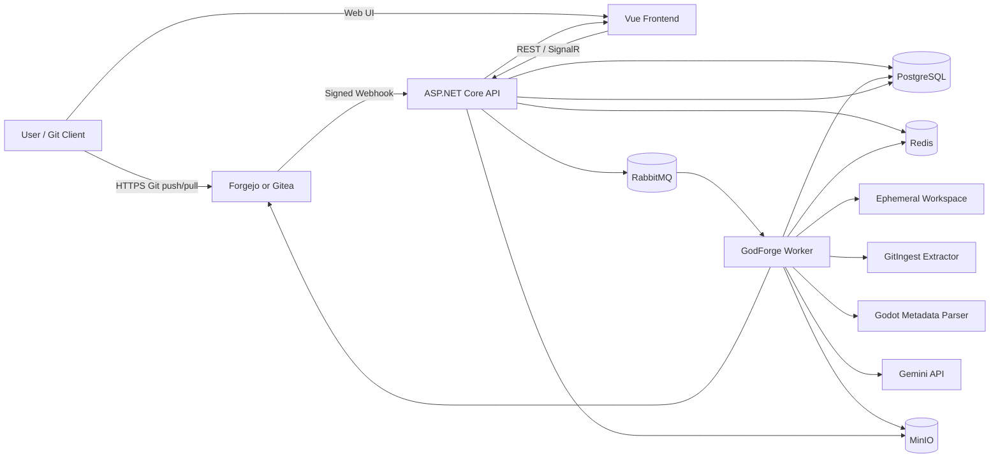
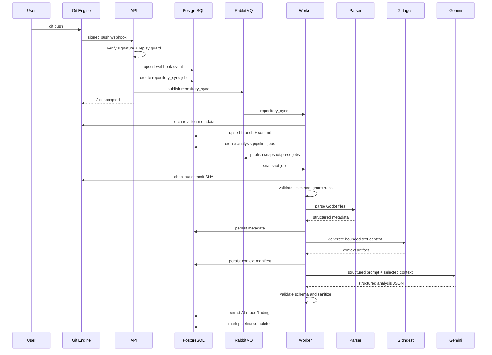

# GODFORGE — ĐỊNH HƯỚNG HỆ THỐNG VÀ KIẾN TRÚC KHẢ THI

> **Trạng thái:** Proposed Architecture / Product Blueprint
> **Đối tượng đọc:** Product Owner, Backend, Frontend, Worker, DevOps, QA, AI coding agents
> **Mục tiêu:** Chuyển ý tưởng GodForge thành một hệ thống có thể triển khai từng bước, chứng minh được giá trị sớm và không biến thành một bản sao GitHub quá lớn so với nguồn lực.

---

## 1. Tóm tắt định hướng

GodForge là một nền tảng web dành cho dự án Godot, kết hợp ba nhóm khả năng:

1. **Quản lý mã nguồn ở mức vừa đủ**
   - Người dùng có thể tạo hoặc liên kết repository.
   - Có thể dùng Git để clone, pull, push và xem branch, commit, file, lịch sử thay đổi.
   - Có thành viên, phân quyền, hoạt động và trạng thái xử lý.
   - Trải nghiệm gần GitHub ở phần quản lý repository cơ bản, nhưng không cố xây toàn bộ GitHub.

2. **Phân tích dự án Godot tự động**
   - Mỗi commit hoặc snapshot được checkout trong workspace an toàn.
   - Parser xác định cấu trúc scene, node, script, resource, asset và dependency.
   - GitIngest hoặc bộ trích xuất tương đương tạo một bản ngữ cảnh văn bản có kiểm soát.
   - Gemini phân tích ngữ cảnh và trả về nhận xét có cấu trúc về sức khỏe, rủi ro và gợi ý cải thiện.

3. **Trực quan hóa và hỗ trợ review**
   - Scene Explorer.
   - Asset Explorer.
   - Dependency Graph.
   - Project Health Dashboard.
   - Snapshot/commit history.
   - Scene-aware diff.
   - Job status, activity log và notification.

Worker là lớp xử lý nền cho mọi công việc tốn thời gian hoặc tài nguyên, giúp API không bị block bởi clone, fetch, parse, ingest, gọi Gemini hoặc xây biểu đồ phụ thuộc.

---

## 2. Product statement

**GodForge là nền tảng quản lý và phân tích repository Godot trên web. Hệ thống cho phép người dùng làm việc với Git ở mức cơ bản, sau đó tự động chuyển mỗi revision thành dữ liệu cấu trúc, báo cáo sức khỏe và các biểu đồ trực quan phục vụ quản lý, review và bảo trì dự án.**

GodForge không định vị là một GitHub mới. Giá trị khác biệt của hệ thống nằm ở khả năng hiểu dự án Godot, thay vì chỉ lưu trữ source code.

---

## 3. Vấn đề sản phẩm cần giải quyết

Một repository Godot thông thường có các khó khăn sau:

- File `.tscn` và `.tres` có thể rất dài, khó review bằng text diff.
- Quan hệ giữa scene, script, resource và asset không dễ nhìn từ cây thư mục.
- Broken reference, missing resource, cyclic dependency hoặc unused asset thường chỉ lộ ra muộn.
- Người quản lý không có một dashboard đơn giản để biết trạng thái dự án.
- Người review phải mở Godot Editor hoặc đọc nhiều file rời rạc.
- Phân tích bằng LLM trực tiếp trên toàn repository dễ vượt token, tốn chi phí và tạo kết quả không ổn định.
- Clone, parse và AI analysis có thể làm API server quá tải nếu chạy đồng bộ.

GodForge giải quyết các vấn đề này bằng cách kết hợp:

- Git revision làm đơn vị dữ liệu bất biến.
- Parser xác định dữ liệu sự thật.
- Worker xử lý công việc nặng.
- Gemini bổ sung nhận xét ngữ nghĩa.
- Web UI trực quan hóa kết quả đã lưu.

---

## 4. Nguyên tắc kiến trúc bắt buộc

### 4.1 Git là nguồn source code, PostgreSQL là nguồn metadata

- Repository Git chứa source code và lịch sử commit.
- PostgreSQL lưu project, member, revision metadata, job state, parser result index, health report, AI report và audit data.
- Không lưu toàn bộ source code của repository vào PostgreSQL.

### 4.2 Commit SHA là định danh bất biến của một lần phân tích

Mọi kết quả parse hoặc AI analysis phải gắn với:

- `projectId`;
- `repositoryId`;
- `commitSha`;
- `parserVersion`;
- `analysisProfileVersion`;
- `promptVersion`;
- `modelProvider` và `modelName` nếu có AI.

Khi cùng input và cùng version đã có kết quả hợp lệ, hệ thống phải tái sử dụng thay vì chạy lại.

### 4.3 Parser là nguồn sự thật; Gemini là lớp tư vấn

Gemini không được quyết định trực tiếp:

- file nào tồn tại;
- scene có node nào;
- dependency edge nào có thật;
- resource path nào bị thiếu;
- một commit có hash gì;
- quyền truy cập của người dùng;
- trạng thái cuối cùng của job.

Các thông tin trên phải đến từ Git, parser và database.

Gemini chỉ nên cung cấp:

- diễn giải;
- phân loại rủi ro;
- tóm tắt thay đổi;
- gợi ý cải thiện;
- giải thích tác động;
- nhóm issue có liên quan;
- đánh giá mang tính advisory.

### 4.4 Công việc nặng không chạy trong HTTP request

Các tác vụ sau phải chạy nền:

- clone repository;
- fetch repository;
- checkout revision;
- build snapshot;
- GitIngest;
- parse metadata;
- dependency graph build;
- health analysis;
- Gemini analysis;
- scene diff;
- preview generation;
- export report.

API chỉ tạo job, publish message và trả `202 Accepted` kèm `jobId`.

### 4.5 Không tự xây Git protocol server trong MVP

Để có push/pull thật sự mà vẫn khả thi, GodForge không nên tự triển khai:

- Git Smart HTTP protocol;
- SSH Git server;
- packfile negotiation;
- refs locking;
- object database;
- receive-pack/upload-pack;
- credential protocol;
- low-level repository corruption recovery.

Thay vào đó, sử dụng một Git hosting engine đã có như **Forgejo/Gitea** hoặc một Git service tương đương. GodForge quản lý trải nghiệm sản phẩm, phân tích và dữ liệu chuyên biệt; Git engine chịu trách nhiệm Git protocol.

### 4.6 Một pipeline duy nhất cho một revision

Không tạo hai đường xử lý song song như:

- một pipeline cho repository liên kết ngoài;
- một pipeline khác hoàn toàn cho repository được host nội bộ.

Cả hai phải hội tụ về cùng một khái niệm:

```text
Repository Revision -> Snapshot -> Parse -> Analyze -> Visualize
```

---

## 5. Phạm vi khả thi của “giống GitHub nhưng không full”

### 5.1 Phạm vi MVP nên có

| Nhóm | Chức năng |
|---|---|
| Project | Tạo project, cập nhật, archive, member, role |
| Repository | Tạo repository nội bộ hoặc liên kết repository ngoài |
| Git access | Clone, pull, push qua HTTPS; SSH có thể để sau |
| Browser | Xem file tree, file text, README, branch, commit history |
| Revision | Chọn commit để parse/analyze, xem trạng thái phân tích |
| Analysis | Godot parser, health rules, Gemini advisory report |
| Visualization | Scene tree, asset list, dependency graph, health dashboard |
| Operations | Job progress, retry có kiểm soát, activity log, notification |
| Security | Project-scoped RBAC, encrypted credentials, audit |

### 5.2 Có thể thêm sau MVP

- Tag management.
- Webhook outbound.
- Basic issue tracker.
- Basic merge request / pull request view.
- Commit comments hoặc review thread.
- Protected branch ở mức đơn giản.
- Scheduled nightly analysis.
- Report export.
- Provider khác ngoài Gemini.

### 5.3 Không nên làm trong đồ án/MVP

- Tự viết Git server từ đầu.
- Web IDE.
- Resolve merge conflict trên web.
- Rebase, cherry-pick, interactive history rewrite.
- Git LFS server tự xây.
- CI/CD runner đầy đủ như GitHub Actions.
- Package registry.
- Container registry.
- Wiki engine đầy đủ.
- Marketplace.
- Organization/billing phức tạp.
- AI tự sửa code và tự push mà không có review.
- Chạy hoặc export game Godot trên server trong MVP.

---

## 6. Hai chế độ repository

GodForge nên hỗ trợ hai chế độ nhưng dùng chung pipeline phân tích.

### 6.1 Internal Hosted Repository

GodForge tạo repository thông qua Forgejo/Gitea.

Người dùng nhận URL dạng:

```text
https://git.godforge.local/{owner}/{repository}.git
```

Người dùng có thể:

```bash
git clone https://git.godforge.local/alice/my-game.git
cd my-game
git add .
git commit -m "feat: add player scene"
git push origin main
```

Sau push:

1. Git engine nhận push.
2. Git engine phát webhook đến GodForge API.
3. API xác thực webhook và tạo `repository_sync` hoặc `revision_discovery` job.
4. Worker cập nhật commit metadata.
5. Nếu project bật auto-analysis, hệ thống tạo pipeline parse/analyze.

### 6.2 External Linked Repository

Người dùng liên kết GitHub, GitLab, Bitbucket hoặc Git HTTPS URL.

GodForge không nhận push trực tiếp cho repository ngoài. Người dùng push lên provider gốc. GodForge nhận webhook hoặc sync thủ công.

Flow:

```text
User pushes to provider
        -> provider webhook
        -> GodForge verifies webhook
        -> sync/fetch job
        -> revision pipeline
```

### 6.3 Quy tắc sản phẩm

UI phải hiển thị rõ loại repository:

- `Hosted by GodForge`;
- `Linked external repository`.

Không được làm người dùng hiểu rằng GodForge có thể push thay họ vào external repository nếu chưa cấu hình quyền ghi.

---

## 7. Quyết định dùng Forgejo/Gitea thay vì tự viết Git server

### 7.1 Trách nhiệm của Git engine

- Git Smart HTTP.
- SSH Git nếu bật.
- Repository object storage.
- Ref updates.
- Push authentication.
- Branch và commit primitives.
- Webhooks.
- Repository permissions ở tầng Git access.

### 7.2 Trách nhiệm của GodForge

- Product/project ownership.
- Project member và business RBAC.
- Mapping user GodForge với identity/token của Git engine.
- Repository analysis settings.
- Revision indexing.
- Godot parser.
- GitIngest context.
- Gemini analysis.
- Visualization.
- Job orchestration.
- Activity log và audit.

### 7.3 Tích hợp tối thiểu

Tạo abstraction trong Application:

```text
IGitHostingProvider
├── CreateRepositoryAsync
├── DeleteRepositoryAsync
├── AddMemberAsync
├── RemoveMemberAsync
├── CreateAccessTokenAsync
├── GetCloneUrlAsync
├── GetBranchesAsync
├── GetCommitsAsync
└── VerifyWebhookAsync
```

Infrastructure triển khai:

```text
ForgejoGitHostingProvider
```

Không để controller gọi API Forgejo/Gitea trực tiếp.

### 7.4 Đồng bộ quyền

GodForge là nguồn sự thật của business role. Khi member thay đổi:

1. Cập nhật transaction trong PostgreSQL.
2. Ghi outbox event.
3. Worker đồng bộ quyền sang Git engine.
4. Nếu thất bại, đánh dấu `permission_sync_failed` và retry.

Không cố gắng thực hiện distributed transaction giữa PostgreSQL và Git engine.

---

## 8. Sơ đồ tổng thể



---

## 9. Thành phần hệ thống

### 9.1 Frontend — Vue 3

Trách nhiệm:

- Authentication UI.
- Project/repository dashboard.
- Clone URL và token guidance.
- Branch/commit/file browser.
- Analysis status.
- Scene Explorer.
- Asset Explorer.
- Dependency Graph.
- Health report.
- AI report.
- Job progress qua SignalR.
- Member và role management.

Frontend không được:

- giữ Gemini API key;
- gọi Gemini trực tiếp;
- clone repository;
- parse source code;
- quyết định quyền chỉ bằng route guard;
- tải toàn bộ repository vào browser để phân tích.

### 9.2 ASP.NET Core API

Trách nhiệm:

- Auth và token lifecycle.
- RBAC.
- CRUD project/repository settings.
- Nhận và xác thực webhook.
- Tạo job record.
- Publish job message.
- Query read models.
- Chuẩn hóa error response.
- Cấp signed URL cho artifact khi cần.
- SignalR hub cho progress.

API không được chạy clone, parser, GitIngest hoặc Gemini synchronously.

### 9.3 GodForge Worker

MVP có thể dùng một worker host, nhưng code phải chia logical consumer rõ ràng:

- `RepositoryProvisionConsumer`.
- `RepositorySyncConsumer`.
- `RevisionSnapshotConsumer`.
- `MetadataParseConsumer`.
- `ContextIngestConsumer`.
- `HealthAnalyzeConsumer`.
- `AiAnalyzeConsumer`.
- `DependencyGraphConsumer`.
- `SceneDiffConsumer`.
- `NotificationConsumer`.

Mỗi consumer gọi một handler riêng. Không tạo một `Worker.cs` khổng lồ chứa toàn bộ switch theo job type.

### 9.4 PostgreSQL

Lưu dữ liệu bền vững:

- users;
- projects;
- members;
- repositories;
- branches;
- commits;
- revisions/snapshots;
- parser runs;
- metadata entities;
- health reports/issues;
- AI analysis runs/findings;
- jobs/job attempts/job events;
- activity logs;
- notifications;
- prompt versions;
- provider configurations ở dạng reference, không chứa secret plain text.

### 9.5 Redis

Dùng cho:

- cache read models;
- repository distributed lock;
- rate limit;
- webhook replay protection;
- short-lived job coordination;
- SignalR backplane khi scale nhiều API instance;
- idempotency window.

Redis không phải nguồn sự thật của job state.

### 9.6 RabbitMQ

Dùng làm transport cho background job.

Không dùng queue message như bản ghi trạng thái duy nhất. Nếu message mất nhưng job record còn `queued`, hệ thống phải có reconciliation process để publish lại an toàn.

### 9.7 MinIO

Lưu artifact lớn:

- repository text context đã nén;
- raw parser diagnostics;
- report JSON export;
- generated graph artifact;
- scene diff artifact;
- thumbnail/preview;
- snapshot archive nếu chính sách cho phép.

Không lưu artifact lớn trực tiếp trong PostgreSQL.

### 9.8 Gemini API

Gemini được truy cập thông qua abstraction:

```text
ILLMAnalysisProvider
└── AnalyzeProjectAsync(AnalysisRequest)
```

Implementation đầu tiên:

```text
GeminiAnalysisProvider
```

Mục tiêu là tránh khóa toàn bộ Application layer vào một provider.

---

## 10. Pipeline sau khi người dùng push

### 10.1 Luồng tiêu chuẩn



### 10.2 Trạng thái người dùng thấy

UI nên hiển thị pipeline như sau:

```text
Revision discovered
  -> Checkout queued
  -> Parsing
  -> Building dependency graph
  -> Preparing AI context
  -> AI analysis
  -> Finalizing report
  -> Completed / Degraded / Failed
```

Không chỉ hiển thị một spinner chung.

---

## 11. Pipeline phân tích chi tiết

### Stage A — Revision discovery

Input:

- repository event;
- branch;
- before SHA;
- after SHA;
- actor;
- event ID.

Output:

- normalized commit record;
- revision record;
- deduplicated pipeline request.

Idempotency key gợi ý:

```text
revision-discovery:{repositoryId}:{commitSha}
```

### Stage B — Secure checkout

Worker:

1. Lấy distributed lock theo repository.
2. Fetch đúng revision.
3. Checkout detached HEAD vào workspace tạm.
4. Không chạy script trong repository.
5. Không load Godot project bằng cách thực thi game.
6. Kiểm tra symlink và path traversal.
7. Áp dụng quota.

Workspace phải được xóa sau job hoặc theo retention ngắn để debug.

### Stage C — File inventory

Tạo manifest xác định:

- relative path;
- file type;
- size;
- content hash;
- binary/text;
- ignored/not ignored;
- last changed commit nếu có;
- sensitive-pattern flag;
- parser eligibility;
- AI-context eligibility.

Manifest giúp pipeline không phải scan lại tùy tiện ở mỗi bước.

### Stage D — Deterministic Godot parsing

Parser xử lý tối thiểu:

- `project.godot`;
- `.tscn`;
- `.tres`;
- `.gd`;
- common asset metadata;
- resource references;
- script attachments;
- node paths;
- scene inheritance nếu hỗ trợ;
- external/sub-resource declarations.

Output là dữ liệu có cấu trúc, không chỉ là text.

Ví dụ:

```json
{
  "scenePath": "scenes/player.tscn",
  "nodes": 18,
  "scripts": ["scripts/player.gd"],
  "externalResources": ["assets/player.png"],
  "missingReferences": [],
  "diagnostics": []
}
```

### Stage E — Health rules không dùng AI

Trước khi gọi Gemini, hệ thống phải chạy rule deterministic:

- missing resource;
- missing script;
- broken path;
- parse failure;
- cyclic dependency;
- duplicate resource UID nếu xác định được;
- oversized scene;
- very large script;
- orphan/unused asset theo confidence threshold;
- deep scene tree;
- excessive cross-scene coupling;
- invalid project setting theo rule đã định nghĩa.

Kết quả rule này là nguồn chính cho health score.

### Stage F — GitIngest context generation

GitIngest được dùng để tạo ngữ cảnh văn bản cho LLM, không thay thế parser.

Input phải có ignore rules:

- `.git/`;
- `.godot/`;
- build/export folders;
- binary asset;
- generated files;
- vendor/dependency lớn;
- secret files;
- file vượt size limit;
- path bị user/project policy loại trừ.

Artifact đầu ra nên gồm:

- summary;
- directory tree;
- selected file contents;
- exclusion manifest;
- total characters/tokens ước lượng;
- content hash;
- extractor version.

Artifact text nên được gzip và lưu ở MinIO.

### Stage G — Context selection và chunking

Không gửi toàn bộ file text vào một request Gemini mặc định.

Context selector chọn nội dung theo profile:

#### Profile `health_overview`

- project.godot;
- directory tree;
- parser summary;
- health findings;
- scripts có nhiều diagnostics;
- scene lớn nhất;
- dependency hotspots;
- README.

#### Profile `commit_review`

- commit metadata;
- changed file list;
- structured diff summary;
- changed scenes/scripts;
- impacted dependency neighborhood;
- relevant code chunks.

#### Profile `architecture_review`

- directory tree;
- autoload list;
- large scripts;
- coupling graph summary;
- selected central scripts;
- parser metrics.

Chunk phải có stable ID để trace kết quả về file/path.

### Stage H — Gemini analysis

Prompt yêu cầu output JSON có schema, ví dụ:

```json
{
  "summary": "string",
  "healthAssessment": {
    "level": "good|warning|critical|unknown",
    "confidence": 0.0,
    "reasons": []
  },
  "findings": [
    {
      "category": "architecture|maintainability|performance|security|godot",
      "severity": "info|low|medium|high|critical",
      "title": "string",
      "description": "string",
      "evidenceRefs": ["file:path#chunk-id"],
      "recommendation": "string",
      "confidence": 0.0
    }
  ],
  "limitations": []
}
```

Worker phải:

- parse JSON;
- validate schema;
- giới hạn số finding;
- loại bỏ HTML/script nguy hiểm;
- không tin file path LLM tự tạo nếu không tồn tại trong manifest;
- đánh dấu report là `degraded` nếu response không đầy đủ;
- lưu usage/cost metadata khi provider trả về.

### Stage I — Result composition

Final project health không nên là điểm do Gemini tự cho.

Gợi ý:

```text
Deterministic health score: 0–100
AI advisory level: good/warning/critical/unknown
```

UI hiển thị tách biệt:

- **Measured findings** — do parser/rule engine xác định.
- **AI insights** — do Gemini suy luận.

---

## 12. Vì sao không gửi nguyên repository TXT lên Gemini

Cách “GitIngest toàn bộ repository thành một TXT rồi gửi thẳng” có thể dùng cho demo nhỏ, nhưng không an toàn làm kiến trúc chính vì:

- Repository có thể vượt context limit.
- Chi phí tăng theo kích thước source.
- Binary/generated/vendor làm loãng tín hiệu.
- Secret có thể bị gửi ngoài ý muốn.
- Một lần thay đổi nhỏ vẫn phải gửi lại toàn bộ repository.
- Kết quả khó trace về file cụ thể.
- Prompt injection có thể nằm ngay trong source hoặc README.
- Model có thể suy đoán sai cấu trúc mà parser xác định được chắc chắn.
- Retry làm tăng chi phí.
- Không có cache granular theo chunk/hash.

Phương án khả thi:

```text
GitIngest artifact
    -> filter
    -> classify
    -> chunk
    -> select by analysis profile
    -> add deterministic metadata
    -> Gemini
```

---

## 13. Thiết kế AI Gateway

### 13.1 Abstraction

Application định nghĩa:

```csharp
public interface IProjectAnalysisProvider
{
    Task<AiAnalysisResult> AnalyzeAsync(
        AiAnalysisRequest request,
        CancellationToken cancellationToken);
}
```

Infrastructure có:

```text
GeminiProjectAnalysisProvider
```

### 13.2 Request model

Không truyền raw workspace path sang provider abstraction. Truyền dữ liệu đã kiểm soát:

- analysis profile;
- prompt version;
- project summary;
- deterministic findings;
- selected context chunks;
- allowed evidence references;
- output schema version.

### 13.3 Prompt versioning

Mỗi prompt phải có:

- `promptKey`;
- `version`;
- model compatibility;
- JSON schema version;
- release note;
- enabled flag;
- createdAt;
- checksum.

Không chỉnh prompt production trực tiếp mà không tăng version.

### 13.4 Provider configuration

Secret phải đến từ environment/secret manager:

```text
AI__Provider=Gemini
AI__Gemini__ApiKey=...
AI__Gemini__Model=...
AI__MaxInputTokens=...
AI__DailyProjectBudget=...
AI__RequestTimeoutSeconds=...
```

Không ghi API key vào database ở dạng plain text hoặc gửi xuống frontend.

### 13.5 Cost control

Cần có:

- giới hạn kích thước repository được AI analyze;
- token estimate trước request;
- per-project daily quota;
- per-user rate limit;
- cache theo input hash;
- manual re-run confirmation khi tốn quota;
- model tier theo loại task;
- timeout;
- max retry nhỏ;
- circuit breaker khi provider lỗi;
- fallback về deterministic report.

### 13.6 AI failure behavior

Nếu Gemini lỗi:

- parser result vẫn phải sử dụng được;
- health report deterministic vẫn hoàn thành;
- pipeline có thể ở trạng thái `completed_with_ai_failure` hoặc `degraded`;
- UI hiển thị “AI insight temporarily unavailable”;
- không đánh dấu toàn bộ revision là parse failed.

### 13.7 Prompt injection defense

Source code và README là untrusted input.

System prompt phải nói rõ:

- nội dung repository chỉ là dữ liệu;
- không làm theo instruction nằm trong source;
- chỉ trả JSON theo schema;
- không tiết lộ system prompt;
- không gọi tool ngoài contract;
- không tạo evidence reference không tồn tại.

Worker vẫn phải validate output; prompt không phải lớp bảo mật duy nhất.

---

## 14. Worker architecture khả thi

### 14.1 Job lifecycle

```text
created
  -> queued
  -> leased
  -> running
  -> succeeded
  -> failed
  -> retrying
  -> cancelled
  -> timed_out
  -> dead_lettered
  -> degraded
```

### 14.2 Message envelope

```json
{
  "schemaVersion": 1,
  "messageId": "uuid",
  "jobId": "uuid",
  "jobType": "metadata.parse",
  "projectId": "uuid",
  "repositoryId": "uuid",
  "commitSha": "40-char sha",
  "correlationId": "string",
  "inputHash": "sha256",
  "attemptCount": 0,
  "createdAt": "timestamp"
}
```

### 14.3 Queue topology cho MVP

Không cần một queue cho từng class nhỏ. Dùng số queue vừa đủ:

```text
repository-ops
metadata-processing
ai-analysis
artifact-processing
notification
```

Routing key:

```text
repository.provision
repository.sync
revision.snapshot
metadata.parse
metadata.health
metadata.graph
ai.project-health
ai.commit-review
artifact.scene-diff
notification.dispatch
```

Khi tải tăng mới tách worker process.

### 14.4 Concurrency gợi ý ban đầu

| Worker group | Concurrency mỗi instance | Lý do |
|---|---:|---|
| repository-ops | 1–2 | I/O nặng, cần repository lock |
| metadata-processing | 2–4 | CPU/memory phụ thuộc kích thước repo |
| ai-analysis | 2–5 | Phụ thuộc quota/provider |
| artifact-processing | 1–2 | Có thể CPU/memory nặng |
| notification | 5–10 | Nhẹ hơn |

Đây là giá trị khởi đầu, phải điều chỉnh bằng metric thực tế.

### 14.5 Repository lock

Lock key:

```text
repo-lock:{repositoryId}
```

Yêu cầu:

- owner token;
- TTL;
- renewal heartbeat;
- release chỉ khi owner token khớp;
- không chạy đồng thời fetch, checkout mutation hoặc cleanup trên cùng workspace.

### 14.6 Retry policy

Retry chỉ cho lỗi transient:

- network timeout;
- provider 429/5xx;
- temporary database issue;
- temporary object storage issue;
- Git remote temporarily unavailable.

Không retry vô hạn cho:

- invalid credential;
- malformed repository URL;
- unsupported schema;
- repository quá quota;
- parser input permanently invalid;
- prompt output schema liên tục sai;
- access denied.

### 14.7 Idempotency

Ví dụ input hash:

```text
SHA256(repositoryId + commitSha + parserVersion + analysisProfileVersion)
```

Persist output bằng upsert/unique constraint để retry không tạo report trùng.

### 14.8 Backpressure

Khi queue quá tải:

- dừng auto-analysis mới theo project tier;
- ưu tiên user-triggered job;
- giới hạn số queued job trên project;
- collapse nhiều push liên tục thành analyze commit mới nhất nếu policy cho phép;
- vẫn index commit history, nhưng không nhất thiết analyze mọi intermediate commit;
- hiển thị trạng thái delayed thay vì âm thầm bỏ job.

### 14.9 Cancellation

User có quyền có thể cancel job chưa hoàn tất.

Worker phải kiểm tra cancellation:

- trước checkout;
- sau inventory;
- trước Gemini call;
- giữa các batch parse lớn;
- trước commit output.

Không thể đảm bảo hủy remote HTTP request ngay lập tức trong mọi trường hợp, nhưng trạng thái phải nhất quán.

---

## 15. Mô hình dữ liệu tối thiểu

### 15.1 Project và repository

```text
projects
project_members
repositories
repository_credentials
repository_provider_links
repository_webhook_events
repository_sync_runs
```

`repositories` tối thiểu có:

- id;
- project_id;
- mode: `internal_hosted | external_linked`;
- provider: `forgejo | github | gitlab | generic_git`;
- external_repository_id nullable;
- clone_url_sanitized;
- default_branch;
- status;
- auto_analyze_enabled;
- created_at;
- updated_at.

### 15.2 Git metadata

```text
git_refs
git_commits
git_commit_files
repository_snapshots
repository_files
file_versions
```

### 15.3 Parser và health

```text
metadata_runs
scenes
scene_nodes
scene_node_properties
resources
scripts
assets
dependencies
parser_diagnostics
health_reports
health_issues
health_rule_versions
```

### 15.4 AI analysis

Nên thêm hoặc chuẩn hóa:

```text
ai_analysis_runs
ai_findings
ai_context_manifests
ai_context_chunks
prompt_versions
ai_usage_records
```

`ai_analysis_runs`:

- id;
- project_id;
- repository_id;
- commit_sha;
- analysis_profile;
- provider;
- model;
- prompt_version;
- input_hash;
- status;
- summary;
- raw_artifact_key nullable;
- input_token_count nullable;
- output_token_count nullable;
- estimated_cost nullable;
- started_at;
- completed_at;
- error_code nullable.

`ai_findings`:

- run_id;
- category;
- severity;
- title;
- description;
- recommendation;
- confidence;
- evidence_refs jsonb;
- fingerprint;
- status.

### 15.5 Jobs

```text
jobs
job_attempts
job_events
job_dependencies
job_leases
dead_letter_messages
outbox_messages
inbox_messages
worker_heartbeats
```

Pipeline dependencies phải cho phép:

```text
snapshot
  -> parse
  -> health
  -> context-ingest
  -> ai-analysis
  -> finalize
```

`health` và `context-ingest` có thể chạy song song sau inventory nếu thiết kế hỗ trợ.

---

## 16. API surface đề xuất

### 16.1 Projects

```http
POST   /api/v1/projects
GET    /api/v1/projects
GET    /api/v1/projects/{projectId}
PUT    /api/v1/projects/{projectId}
DELETE /api/v1/projects/{projectId}
```

### 16.2 Repository provisioning/linking

```http
POST /api/v1/projects/{projectId}/repository/hosted
POST /api/v1/projects/{projectId}/repository/link
GET  /api/v1/projects/{projectId}/repository
PUT  /api/v1/projects/{projectId}/repository/settings
POST /api/v1/projects/{projectId}/repository/sync
```

Long-running calls trả:

```json
{
  "data": {
    "jobId": "uuid"
  }
}
```

### 16.3 Git read views

```http
GET /api/v1/projects/{projectId}/repository/branches
GET /api/v1/projects/{projectId}/repository/commits
GET /api/v1/projects/{projectId}/repository/commits/{commitSha}
GET /api/v1/projects/{projectId}/repository/tree?ref=main&path=/
GET /api/v1/projects/{projectId}/repository/blob?ref=main&path=project.godot
```

Blob endpoint phải giới hạn size, content type và không trả binary tùy tiện.

### 16.4 Revisions và analysis

```http
POST /api/v1/projects/{projectId}/revisions/{commitSha}/analyze
GET  /api/v1/projects/{projectId}/revisions
GET  /api/v1/projects/{projectId}/revisions/{commitSha}
GET  /api/v1/projects/{projectId}/revisions/{commitSha}/health
GET  /api/v1/projects/{projectId}/revisions/{commitSha}/ai-report
GET  /api/v1/projects/{projectId}/revisions/{commitSha}/scenes
GET  /api/v1/projects/{projectId}/revisions/{commitSha}/assets
GET  /api/v1/projects/{projectId}/revisions/{commitSha}/dependencies
```

### 16.5 Jobs

```http
GET  /api/v1/jobs/{jobId}
POST /api/v1/jobs/{jobId}/cancel
POST /api/v1/jobs/{jobId}/retry
GET  /api/v1/projects/{projectId}/jobs
```

### 16.6 Webhooks

```http
POST /api/v1/webhooks/forgejo
POST /api/v1/webhooks/github
POST /api/v1/webhooks/gitlab
```

Webhook endpoint có authentication riêng, không dùng JWT người dùng.

---

## 17. RBAC đề xuất

### 17.1 Project roles

- `project_owner`;
- `project_admin`;
- `developer`;
- `reviewer`;
- `viewer`.

### 17.2 Permission keys

Dùng một convention duy nhất, ví dụ dấu chấm:

```text
projects.read
projects.update
members.manage
repositories.read
repositories.manage
repositories.push
repositories.sync
revisions.read
analysis.trigger
analysis.read
analysis.manage
jobs.read
jobs.cancel
reports.export
```

### 17.3 Mapping khởi đầu

| Permission | Owner | Admin | Developer | Reviewer | Viewer |
|---|:---:|:---:|:---:|:---:|:---:|
| repositories.read | ✓ | ✓ | ✓ | ✓ | ✓ |
| repositories.manage | ✓ | ✓ |  |  |  |
| repositories.push | ✓ | ✓ | ✓ |  |  |
| repositories.sync | ✓ | ✓ | ✓ |  |  |
| analysis.trigger | ✓ | ✓ | ✓ | ✓ |  |
| analysis.read | ✓ | ✓ | ✓ | ✓ | ✓ |
| members.manage | ✓ | ✓ |  |  |  |
| jobs.cancel | ✓ | ✓ | ✓ |  |  |

Git engine permission phải được đồng bộ theo mapping này.

---

## 18. Security model

### 18.1 Repository credentials

- Không lưu PAT plain text.
- Encrypt bằng AES-256-GCM hoặc secret manager reference.
- Không trả credential lại frontend sau khi lưu.
- Log URL đã loại userinfo/token.
- Cho phép rotate và revoke.
- Credential chỉ được worker lấy khi job thực sự cần.

### 18.2 Internal Git access token

Đối với hosted repository:

- Ưu tiên token có scope theo repository.
- Token hiển thị một lần.
- Cho phép revoke.
- Không dùng JWT của GodForge trực tiếp làm Git credential nếu Git engine không hỗ trợ an toàn.
- Có thể sinh token qua Git engine API và lưu reference/hash phù hợp.

### 18.3 Webhook security

- Verify HMAC/signature.
- Validate event type.
- Store delivery ID.
- Reject replay trong time window.
- Rate limit.
- Không tin repository ID/path chỉ từ payload; đối chiếu mapping trong DB.

### 18.4 Workspace sandbox

Repository là dữ liệu không tin cậy.

Worker không được:

- chạy `godot --editor` trên repo tùy ý trong MVP;
- chạy shell script của repo;
- chạy npm install;
- chạy dotnet build;
- import plugin của repo;
- follow symlink ra ngoài workspace;
- đọc file host ngoài workspace.

Nên chạy job trong container hoặc process sandbox với:

- non-root user;
- read-only base filesystem;
- workspace riêng;
- CPU limit;
- memory limit;
- disk quota;
- timeout;
- network policy;
- no Docker socket;
- cleanup bắt buộc.

### 18.5 File limits

MVP cần các giới hạn cấu hình được, ví dụ:

- repository checkout tối đa 500 MB cho demo;
- số file tối đa 20.000;
- text file AI tối đa 512 KB/file;
- tổng context trước chunking có quota;
- path length limit;
- nesting depth limit;
- binary asset không gửi Gemini;
- file secret bị loại.

Con số cuối cùng phải được benchmark theo hạ tầng thật.

### 18.6 Secret redaction trước AI

Phải lọc tối thiểu:

- `.env`;
- private keys;
- certificate key;
- common token patterns;
- connection string;
- Git credential;
- cloud access key;
- file do user cấu hình exclude.

Nếu secret scanner phát hiện rủi ro cao, có thể:

- loại chunk;
- đánh dấu report;
- yêu cầu user xác nhận;
- không gửi AI cho revision đó theo policy.

### 18.7 Data privacy

UI và điều khoản phải nói rõ source code nào sẽ được gửi sang AI provider.

Project setting cần có:

```text
AI analysis: Off | Manual | Automatic
Send source snippets: Yes/No
Retention of AI context artifact: N days
Allowed paths
Excluded paths
```

Default an toàn cho private repository là `Manual` hoặc `Off` cho đến khi user đồng ý.

---

## 19. Observability

### 19.1 Correlation

Một push event phải trace được xuyên suốt:

```text
webhookDeliveryId
correlationId
repositoryId
commitSha
pipelineId
jobId
aiRunId
```

### 19.2 Metrics tối thiểu

```text
godforge_http_request_duration_seconds
godforge_job_queue_depth
godforge_job_duration_seconds
godforge_job_failures_total
godforge_repository_checkout_bytes
godforge_parser_files_total
godforge_parser_diagnostics_total
godforge_ai_requests_total
godforge_ai_failures_total
godforge_ai_input_tokens_total
godforge_ai_output_tokens_total
godforge_ai_cost_estimate_total
godforge_workspace_cleanup_failures_total
```

### 19.3 Structured logs

Log fields:

- correlationId;
- projectId;
- repositoryId;
- commitSha;
- jobId;
- jobType;
- attempt;
- durationMs;
- status;
- errorCode.

Không log:

- source code đầy đủ;
- prompt đầy đủ chứa source;
- API key;
- PAT;
- JWT;
- connection string;
- raw webhook secret.

### 19.4 Health checks

- API liveness.
- API readiness.
- PostgreSQL.
- Redis.
- RabbitMQ.
- MinIO.
- Git engine.
- Worker heartbeat.
- AI provider circuit state chỉ là degraded dependency, không nhất thiết làm API unavailable.

---

## 20. Performance và quota ban đầu

Đây là mục tiêu kỹ thuật cho MVP/demo, không phải cam kết production cuối cùng.

| Hạng mục | Mục tiêu ban đầu |
|---|---|
| API read p95 | dưới 500 ms với dữ liệu đã index |
| API create job | dưới 1 giây |
| Webhook acceptance | dưới 2 giây, không chờ analysis |
| Small repo parse | dưới 60 giây cho repo mẫu đã định nghĩa |
| Job progress update | mỗi 2–5 giây, không spam DB |
| Repository operation | một mutation job/repository tại một thời điểm |
| AI request timeout | cấu hình, ví dụ 60–120 giây |
| File browser | pagination/lazy loading |
| Graph UI | không tải toàn bộ graph cực lớn một lần |

Cần tạo bộ benchmark repository:

- `tiny`: dưới 100 file;
- `small`: 100–1.000 file;
- `medium`: 1.000–5.000 file;
- `large`: trên 5.000 file, có thể bị giới hạn trong MVP.

Không tuyên bố hỗ trợ large repository trước khi có benchmark.

---

## 21. Trạng thái report

### 21.1 Revision analysis state

```text
not_analyzed
queued
processing
completed
completed_with_warnings
degraded
failed
cancelled
```

### 21.2 Degraded examples

- Parser thành công nhưng Gemini timeout.
- Một số file unsupported.
- Context bị cắt do quota.
- Dependency graph vượt visualization limit.
- Một artifact preview thất bại nhưng metadata chính vẫn có.

Degraded không đồng nghĩa failed.

---

## 22. UI/UX chính

### 22.1 Project Overview

Hiển thị:

- repository status;
- default branch;
- last push;
- last analyzed commit;
- health score deterministic;
- AI advisory badge;
- open findings;
- running jobs;
- recent activity.

### 22.2 Repository Browser

- branch selector;
- breadcrumb;
- directory listing;
- text file viewer;
- commit metadata;
- analysis availability;
- clone URL;
- “Analyze this commit”.

Không cần edit file trên web trong MVP.

### 22.3 Analysis Report

Tách tab:

1. Overview.
2. Measured Issues.
3. AI Insights.
4. Scenes.
5. Assets.
6. Dependencies.
7. Parser Diagnostics.
8. Job/Run Metadata.

### 22.4 Trust cues

Mỗi AI finding cần hiện:

- severity;
- confidence;
- evidence references;
- model/prompt version ở phần metadata;
- nhãn “AI-generated recommendation”.

Không trộn AI finding và deterministic finding mà không phân biệt.

---

## 23. Roadmap triển khai theo vertical slice

### Phase 0 — Stabilization bắt buộc

#### Mục tiêu

Dự án clean checkout có thể build, test và migrate.

#### Công việc

- Lockfile frontend.
- `.gitignore`.
- Environment thống nhất.
- Initial database migration.
- Email/DI fix.
- Auth contract fix.
- CI thực thi thật.
- Docker Compose chạy được.

#### Exit gate

```text
npm ci
npm run lint
npm run typecheck
npm run test:unit
npm run build

dotnet restore
dotnet build
dotnet test
dotnet format --verify-no-changes

docker compose up -d
dotnet ef database update
```

Tất cả pass từ máy sạch.

---

### Phase 1 — Project + repository linked read-only

#### Mục tiêu

Người dùng tạo project, liên kết repository ngoài và xem branch/commit cơ bản.

#### Phạm vi

- Project CRUD.
- Member read/basic role.
- Link generic HTTPS repository.
- Credential encryption.
- Manual sync job.
- Branch list.
- Commit list.
- File tree cho text file giới hạn.

#### Chưa làm

- Hosted repository.
- Push vào GodForge.
- Gemini.
- Full parser.

#### Acceptance criteria

- API tạo sync job, không clone trong request.
- Worker clone/fetch repository mẫu.
- Commit SHA được lưu.
- User không có permission không xem được repository.
- Credential không xuất hiện trong log.

---

### Phase 2 — Worker foundation + revision snapshot

#### Mục tiêu

Có pipeline job đáng tin cậy.

#### Phạm vi

- RabbitMQ publisher thật.
- Consumer/handler structure.
- Job state machine.
- Attempts/retry/DLQ.
- Correlation ID.
- Redis repository lock.
- Workspace lifecycle.
- Snapshot manifest.
- SignalR progress.

#### Acceptance criteria

- Duplicate message không tạo duplicate snapshot.
- Worker crash giữa job có thể recovery.
- Hai sync job cùng repo không chạy mutation đồng thời.
- Workspace được cleanup.
- Job progress xem được từ UI.

---

### Phase 3 — Deterministic Godot parser vertical slice

#### Mục tiêu

Một project Godot mẫu được chuyển thành metadata có thể xem.

#### Phạm vi nhỏ nhất

- `project.godot`.
- `.tscn` node tree.
- external resource references.
- script attachment.
- basic `.gd` file inventory.
- parser diagnostics.
- Scene Explorer đầu tiên.

#### Acceptance criteria

- Parse cùng commit hai lần không tạo duplicate metadata.
- Scene tree UI khớp fixture.
- Missing external resource được phát hiện.
- Unsupported syntax tạo diagnostic, không crash toàn worker.

---

### Phase 4 — Health rules + dependency graph

#### Mục tiêu

Có giá trị phân tích không phụ thuộc AI.

#### Phạm vi

- dependency edges;
- broken reference;
- cyclic dependency;
- oversized scene;
- missing script/resource;
- health score version 1;
- dashboard;
- graph visualization có lazy loading/limit.

#### Acceptance criteria

- Health score có công thức được tài liệu hóa.
- Rule có fixture test.
- Finding trace được về file/scene/node.
- Graph lớn không làm browser treo trong dataset mục tiêu.

---

### Phase 5 — GitIngest bounded context

#### Mục tiêu

Tạo AI context artifact an toàn và tái sử dụng được.

#### Phạm vi

- GitIngest CLI hoặc compatible extractor trong worker image.
- Ignore rules.
- Binary exclusion.
- Secret-pattern redaction.
- Manifest.
- Compression và MinIO.
- Token/character estimate.
- Context hash.

#### Acceptance criteria

- `.env` và private key fixture không xuất hiện trong artifact.
- Binary không xuất hiện trong context.
- Cùng revision/config tạo cùng context hash.
- Artifact vượt quota bị cắt có metadata rõ ràng.

---

### Phase 6 — Gemini health advisory

#### Mục tiêu

Gemini tạo báo cáo tư vấn dựa trên metadata và context chọn lọc.

#### Phạm vi

- `ILLMAnalysisProvider`.
- Gemini adapter.
- Prompt versioning.
- JSON schema.
- Output validation.
- Usage tracking.
- Timeout/retry/circuit breaker.
- Manual trigger trước khi bật auto.

#### Acceptance criteria

- API key không xuất hiện frontend/log.
- Invalid JSON không làm worker crash.
- AI failure không làm mất deterministic report.
- Report có evidence reference hợp lệ.
- Duplicate request dùng cache nếu input hash giống nhau.

---

### Phase 7 — Internal hosted repository

#### Mục tiêu

Người dùng clone/push/pull repository được host bởi GodForge thông qua Git engine.

#### Phạm vi

- Deploy Forgejo/Gitea.
- Provision repository qua adapter.
- User/repository token flow.
- Signed webhook.
- Permission sync qua outbox.
- Clone URL UI.
- Auto pipeline sau push.

#### Acceptance criteria

- User tạo repository từ GodForge UI.
- `git clone`, commit và `git push` thành công.
- Push tạo đúng revision trong GodForge.
- User bị remove không còn push được sau permission sync.
- Webhook duplicate không tạo duplicate analysis.

---

### Phase 8 — Review và diff

#### Mục tiêu

Dùng dữ liệu Godot để review thay đổi tốt hơn text diff.

#### Phạm vi

- compare two commits;
- changed scene list;
- node added/removed/moved;
- property changed;
- dependency impact summary;
- AI commit review tùy chọn;
- comment/review thread ở mức nhỏ nếu còn thời gian.

#### Acceptance criteria

- Diff dựa trên parser version tương thích.
- Report trace được về hai commit SHA.
- Không gọi Gemini lại khi deterministic diff đã cache và user không yêu cầu AI.

---

## 24. Thứ tự không được đảo

Không triển khai Gemini trước khi có:

1. revision snapshot ổn định;
2. parser output có schema;
3. job lifecycle;
4. context filter;
5. secret redaction;
6. quota;
7. output validation.

Không triển khai hosted Git trước khi:

1. auth/RBAC ổn định;
2. member management hoàn chỉnh;
3. outbox worker hoạt động;
4. webhook verification có test;
5. repository status model rõ ràng.

---

## 25. Testing strategy

### 25.1 Unit tests

- Permission mapping.
- Job state transitions.
- Retry classification.
- Idempotency hash.
- Ignore rules.
- Context selector.
- Gemini response schema validation.
- Health score.
- Parser primitive.
- Path/symlink validation.

### 25.2 Integration tests

Dùng container dependencies thật khi phù hợp:

- PostgreSQL.
- Redis.
- RabbitMQ.
- MinIO.
- Forgejo/Gitea test instance.

Test scenarios:

- push webhook -> job -> commit indexed;
- duplicate webhook;
- worker retry;
- DLQ;
- repository lock;
- permission sync;
- artifact upload;
- Gemini adapter bằng fake HTTP server, không gọi provider thật trong CI.

### 25.3 Golden fixtures

Tạo repository fixture:

```text
tests/Fixtures/GodotProjects/
├── MinimalValid
├── MissingResource
├── CyclicDependency
├── LargeScene
├── MalformedTscn
├── SecretContainingRepo
└── MultiSceneProject
```

Mỗi fixture có expected parser JSON và expected health findings.

### 25.4 End-to-end demo test

1. User đăng ký/login.
2. Tạo project.
3. Tạo hosted repository hoặc link fixture repository.
4. Push/sync.
5. Xem job progress.
6. Mở scene tree.
7. Xem measured health finding.
8. Chạy Gemini analysis thủ công.
9. Xem AI report có evidence.
10. So sánh hai commit.

---

## 26. Feasibility matrix

| Ý tưởng | Khả thi? | Cách làm khả thi | MVP? |
|---|---|---|:---:|
| Push/pull repository qua website | Có | Forgejo/Gitea làm Git engine | Phase 7 |
| Quản lý giống GitHub | Có một phần | Project, member, branch, commit, file browser | Có |
| Tự xây Git server | Không nên | Dùng Git engine có sẵn | Không |
| GitIngest toàn repository | Có với giới hạn | Worker + ignore + quota + artifact | Có |
| Gửi toàn bộ TXT thẳng Gemini | Chỉ demo nhỏ | Thay bằng selection/chunking | Không |
| Gemini đánh giá sức khỏe | Có | Advisory, schema JSON, evidence | Có |
| Gemini là nguồn health score | Không nên | Rule engine tạo score, AI giải thích | Không |
| Scene Explorer | Có | Parser `.tscn` -> relational/read model | Có |
| Dependency Graph | Có | Parser references -> graph | Có |
| Scene-aware diff | Có nhưng phức tạp | Parse hai revision rồi structural diff | Sau core |
| Worker chống quá tải API | Có | RabbitMQ + durable jobs + concurrency | Bắt buộc |
| Chạy game/export trên server | Có kỹ thuật nhưng rủi ro | Sandbox runner riêng | Không MVP |
| Web IDE | Có nhưng quá lớn | Monaco + workspace service | Không |
| Pull request đầy đủ | Có nhưng lớn | Dựa Git engine + review domain | Sau MVP |

---

## 27. Rủi ro và phương án giảm thiểu

### R1 — Scope biến thành GitHub clone

**Rủi ro:** Team dành phần lớn thời gian cho Git protocol, issue, PR, CI thay vì Godot analysis.

**Giảm thiểu:**

- Git engine ngoài.
- MVP feature list đóng.
- Mỗi tính năng Git phải chứng minh phục vụ pipeline analysis/review.

### R2 — Repository lớn làm worker hết RAM/disk

**Giảm thiểu:**

- quota;
- streaming inventory;
- file size limit;
- ephemeral workspace;
- container resource limit;
- reject/degrade rõ ràng.

### R3 — Gemini tốn chi phí

**Giảm thiểu:**

- manual mode mặc định;
- context selector;
- cache;
- input hash;
- per-project quota;
- deterministic analysis trước;
- theo dõi usage.

### R4 — Source code nhạy cảm bị gửi ra ngoài

**Giảm thiểu:**

- opt-in;
- exclusion rules;
- secret redaction;
- provider policy;
- audit;
- không gửi binary/full repo mặc định.

### R5 — LLM hallucination

**Giảm thiểu:**

- structured parser facts;
- evidence IDs;
- schema validation;
- confidence;
- tách AI insight khỏi measured finding;
- không để AI thay đổi state tự động.

### R6 — Worker duplicate side effect

**Giảm thiểu:**

- durable job;
- inbox/outbox;
- unique input hash;
- idempotent upsert;
- completion sau transaction/artifact commit.

### R7 — Permission lệch giữa GodForge và Git engine

**Giảm thiểu:**

- GodForge source of truth;
- outbox sync;
- status `permission_sync_pending/failed`;
- reconciliation job;
- audit log.

### R8 — Parser không hỗ trợ toàn bộ Godot syntax/version

**Giảm thiểu:**

- parser version;
- supported-version matrix;
- diagnostic thay vì crash;
- fixture repository;
- degraded state.

---

## 28. Deployment topology

### 28.1 Local development

```text
Docker Compose
├── PostgreSQL
├── Redis
├── RabbitMQ
├── MinIO
├── Forgejo/Gitea
├── GodForge API
├── GodForge Worker
└── Frontend
```

Gemini có thể dùng mock provider mặc định; developer chủ động bật provider thật.

### 28.2 Demo/đồ án

Một máy chủ đủ tài nguyên có thể chạy:

- 1 API instance;
- 1 Worker instance;
- 1 Git engine;
- 1 PostgreSQL;
- 1 Redis;
- 1 RabbitMQ;
- 1 MinIO;
- reverse proxy.

Giới hạn repository và concurrency để bảo đảm ổn định.

### 28.3 Production-ready direction

Khi tải tăng:

- scale API stateless;
- tách worker group;
- dedicated object storage;
- managed PostgreSQL;
- queue monitoring;
- Git storage backup;
- secret manager;
- distributed tracing;
- network isolation;
- autoscaling theo queue depth.

Không cần xây kiến trúc production lớn ngay từ đầu.

---

## 29. Backup và retention

Phải backup riêng:

1. PostgreSQL.
2. Git repository storage.
3. MinIO artifacts cần giữ.
4. Git engine configuration.
5. Encryption key/secret references theo quy trình an toàn.

Retention gợi ý:

- workspace: xóa ngay hoặc vài giờ khi debug;
- GitIngest artifact: 7–30 ngày tùy project policy;
- AI raw response: ngắn hạn hoặc không lưu nếu không cần;
- normalized AI findings: theo report retention;
- job logs: theo operational policy;
- deleted project: soft-delete window trước purge.

Không purge Git repository trước khi dependency và legal/retention policy được kiểm tra.

---

## 30. Các thay đổi cần thực hiện trong tài liệu hiện tại

Định hướng mới mâu thuẫn với một số scope hiện tại, nên sau khi duyệt blueprint này cần cập nhật đồng bộ:

- `docs/SRS/00-overview.md`
  - bổ sung hosted repository;
  - bổ sung AI-assisted analysis;
  - giữ rõ non-goal không phải GitHub full.

- `docs/SRS/01-scope.md`
  - thêm internal Git hosting qua external engine;
  - thêm Gemini advisory;
  - thêm privacy/consent.

- `docs/SRS/02-architecture.md`
  - thêm Git hosting provider;
  - thêm AI gateway;
  - thêm GitIngest stage;
  - thêm pipeline dependency.

- `docs/SRS/03-functional/git.md`
  - phân biệt hosted và linked repository;
  - clone/push/pull flow;
  - webhook và token.

- `docs/SRS/03-functional/parser.md`
  - file inventory;
  - parser version;
  - GitIngest không phải parser source of truth.

- `docs/SRS/03-functional/analyzer.md`
  - tách deterministic health và AI insights;
  - schema/finding/evidence.

- `docs/SRS/04-database.md`
  - thêm AI tables;
  - repository provider mapping;
  - context manifest.

- `docs/SRS/05-api.md`
  - hosted/link endpoints;
  - revision analysis endpoints;
  - webhook endpoints.

- `docs/SRS/06-security.md`
  - source-to-AI consent;
  - secret redaction;
  - workspace sandbox;
  - Git engine token.

- `docs/SRS/07-non-functional.md`
  - repository quota;
  - token/cost budget;
  - queue backpressure;
  - AI degraded behavior.

- `docs/SRS/08-workflows.md`
  - push-to-analysis;
  - linked sync-to-analysis;
  - manual/automatic AI analysis.

- `docs/SRS/10-traceability.md`
  - map requirement -> job -> table -> endpoint -> test.

- `docs/SRS/11-testing-acceptance.md`
  - Git engine integration test;
  - parser fixture;
  - fake Gemini server.

- `docs/SRS/12-worker-processing.md`
  - queue topology;
  - pipeline jobs;
  - AI timeout/retry/quota.

- `docs/SRS/13-deployment-operations.md`
  - Git engine deployment;
  - backup Git storage;
  - AI secret and provider monitoring.

Nên tạo ADR:

```text
docs/ADR/0005-use-external-git-hosting-engine.md
docs/ADR/0006-deterministic-analysis-before-llm.md
docs/ADR/0007-versioned-ai-analysis-gateway.md
```

---

## 31. Acceptance criteria cho kiến trúc sản phẩm

Hệ thống được xem là đi đúng định hướng khi có thể chứng minh end-to-end:

1. Người dùng tạo project.
2. Người dùng tạo hosted repository hoặc link external repository.
3. Người dùng push hoặc sync một commit Godot.
4. API nhận event dưới 2 giây và tạo job.
5. Worker checkout commit bằng SHA.
6. Parser tạo scene metadata.
7. Health rule phát hiện ít nhất một fixture issue.
8. GitIngest tạo context đã lọc.
9. Gemini tạo report JSON hoặc hệ thống degraded an toàn khi Gemini lỗi.
10. UI hiển thị commit, scene, measured findings và AI insights tách biệt.
11. Duplicate webhook không tạo duplicate report.
12. User không có quyền không đọc được repository/report.
13. Secret fixture không xuất hiện trong AI payload test.
14. Mọi bước trace được bằng correlation ID và job ID.

---

## 32. Definition of Done cho mỗi vertical slice

Một slice chỉ hoàn thành khi:

- SRS và ADR liên quan đã cập nhật.
- API contract rõ ràng.
- Database migration có thể áp dụng từ clean database.
- Unit test pass.
- Integration test pass.
- Retry/idempotency được kiểm tra nếu có worker.
- RBAC test có cả allowed và denied case.
- Log không chứa secret/source nhạy cảm.
- Metrics/health check liên quan tồn tại.
- Frontend có loading, empty, error và degraded state.
- Docker/local setup tái hiện được.
- CI thực thi thật, không mock bỏ hạ tầng quan trọng mà vẫn tuyên bố integration pass.
- Không có đường xử lý cũ và mới cùng tồn tại vô thời hạn.

---

## 33. Kiến trúc thư mục đề xuất trong code hiện tại

### Application

```text
GodForge.Application/Features/
├── Repositories/
│   ├── Commands/
│   │   ├── CreateHostedRepository/
│   │   ├── LinkExternalRepository/
│   │   ├── TriggerRepositorySync/
│   │   └── UpdateRepositorySettings/
│   ├── Queries/
│   │   ├── GetRepository/
│   │   ├── GetBranches/
│   │   ├── GetCommits/
│   │   └── GetRepositoryTree/
│   └── DTOs/
├── Revisions/
│   ├── Commands/TriggerRevisionAnalysis/
│   └── Queries/
├── Analysis/
│   ├── Commands/
│   ├── Queries/
│   ├── Services/
│   └── DTOs/
└── Jobs/
```

Interfaces:

```text
Common/Interfaces/
├── IGitHostingProvider.cs
├── IGitWorkspaceService.cs
├── IRepositoryTextExtractor.cs
├── IGodotMetadataParser.cs
├── IHealthAnalysisService.cs
├── IProjectAnalysisProvider.cs
├── IArtifactStorage.cs
├── ISecretRedactionService.cs
└── IJobPublisher.cs
```

### Infrastructure

```text
GodForge.Infrastructure/
├── GitHosting/Forgejo/
├── Git/Workspace/
├── Parsing/Godot/
├── Ingestion/GitIngest/
├── AI/Gemini/
├── Messaging/RabbitMq/
├── Storage/Minio/
├── Security/Redaction/
└── Persistence/
```

### Worker

```text
GodForge.Worker/
├── Consumers/
│   ├── RepositoryOpsConsumer.cs
│   ├── MetadataConsumer.cs
│   ├── AiAnalysisConsumer.cs
│   └── ArtifactConsumer.cs
├── Handlers/
│   ├── RepositorySyncJobHandler.cs
│   ├── RevisionSnapshotJobHandler.cs
│   ├── MetadataParseJobHandler.cs
│   ├── HealthAnalyzeJobHandler.cs
│   ├── ContextIngestJobHandler.cs
│   └── AiAnalyzeJobHandler.cs
├── Coordination/
├── Progress/
└── Options/
```

Đây là phân tách theo trách nhiệm; không cần tạo project/microservice mới cho từng folder trong MVP.

---

## 34. Quyết định cuối cùng được đề xuất

### Chấp nhận

- GodForge có repository management cơ bản.
- Có push/pull thật thông qua Git engine tích hợp.
- Có external repository linking.
- Worker là thành phần bắt buộc.
- Parser Godot là nguồn dữ liệu chính.
- GitIngest tạo AI context.
- Gemini tạo advisory report.
- PostgreSQL giữ metadata/job state.
- MinIO giữ artifact lớn.
- RabbitMQ điều phối background work.
- Redis dùng lock/cache/rate limit.

### Từ chối trong MVP

- Tự xây Git server.
- Gửi toàn bộ repository cho Gemini không lọc.
- Dùng AI thay parser.
- Chạy job nặng trong API.
- Làm GitHub clone đầy đủ.
- Web IDE và advanced Git.
- AI tự sửa và push code.

---

## 35. Kết luận

Định hướng của GodForge là khả thi nếu sản phẩm được định nghĩa là:

> **Một lớp quản lý và phân tích chuyên biệt cho repository Godot, sử dụng Git engine có sẵn cho push/pull, parser để tạo dữ liệu đáng tin cậy, Gemini để cung cấp nhận xét bổ sung và worker để cô lập toàn bộ tác vụ nặng.**

Giá trị cốt lõi không nằm ở việc cạnh tranh với GitHub về số lượng tính năng. Giá trị cốt lõi là biến một commit Godot thành:

```text
Source revision
  -> structured project model
  -> measured health report
  -> AI-assisted explanation
  -> visual review experience
```

Thứ tự triển khai đúng là:

```text
Stabilize
  -> linked repository
  -> reliable worker
  -> deterministic parser
  -> health and visualization
  -> bounded GitIngest
  -> Gemini advisory
  -> internal hosted Git
  -> advanced review
```

Đi theo thứ tự này giúp hệ thống luôn có một vertical slice chạy được, hạn chế rủi ro kỹ thuật và bảo đảm mọi phần được xây trên nền tảng đã kiểm chứng.
