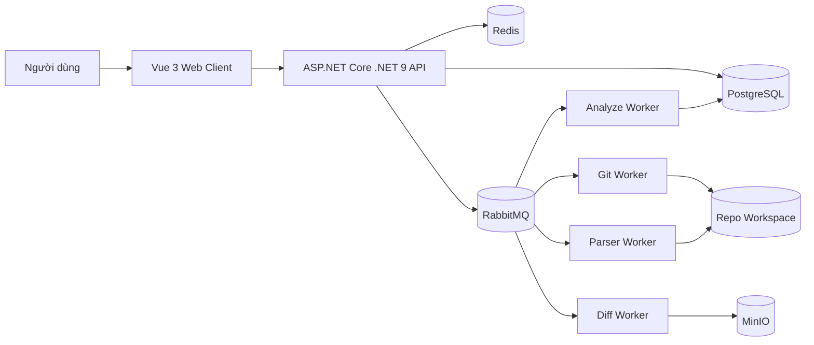

# 2. Kiến trúc tổng quan (Architecture)

*Nguồn: Trích xuất và tổng hợp từ tài liệu Architecture & SRS gốc.*

## 2.1 Kiến trúc logic
Hệ thống áp dụng kiến trúc **web nhiều lớp kết hợp xử lý bất đồng bộ (Modular Monolith + Async Workers)**.
- **Frontend:** Vue 3 (Vite, PrimeVue, Pinia, TypeScript).
- **API Gateway / Backend:** ASP.NET Core .NET 9. Stateless, xử lý routing, auth, RBAC, API validation.
- **Domain Services:** Auth, Project, Git, Metadata, Search, Notification.
- **Async Processing:** Tác vụ nặng (clone, parse, analyze, diff) đẩy vào RabbitMQ, được các Worker xử lý ngầm.
- **Data & Storage:**
  - PostgreSQL: Lưu core data và metadata.
  - Redis: Cache dashboard, lock thao tác Git.
  - MinIO: Object storage lưu artifact, diff, preview.

## 2.2 Sơ đồ khối (High-level)

## 2.3 Nguyên tắc thiết kế
1. **Clean Architecture & Vertical Slice:** Backend tuân thủ DDD, CQRS, tách biệt Domain và Infrastructure.
2. **Async-First:** Tác vụ chậm phải đẩy qua RabbitMQ Worker (không block API).
3. **Repository Lock:** Các thao tác Git dễ xung đột phải dùng distributed lock (Redis).
4. **Không lưu Secret plaintext:** Token Git phải được mã hóa.
5. **Tách biệt Core data & Metadata:** Metadata có thể tái tạo từ repository, core data cần backup ưu tiên.
