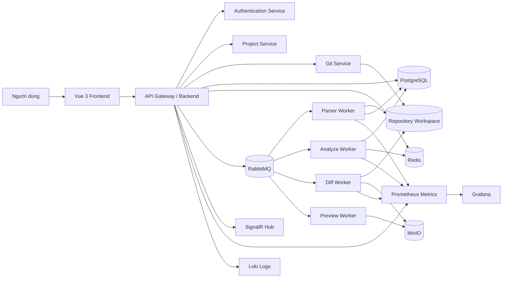

# 2. Kiến trúc tổng quan

## Mục tiêu kiến trúc

GodForge dùng kiến trúc web nhiều lớp kết hợp async workers để tách request/response nhanh khỏi các tác vụ nặng như clone repository, parse metadata, analyze dependency, tạo diff và preview. Kiến trúc ưu tiên tính rõ ràng, khả năng truy vết, kiểm soát quyền và vận hành ổn định.

## Thành phần chính

| Thành phần | Vai trò |
| --- | --- |
| Vue 3 Frontend | Web client cho dashboard, project, Git UI, explorers, graph, diff, notification và admin screens. |
| API Gateway / Backend | ASP.NET Core API, REST `/api/v1`, auth, RBAC, validation, orchestration, response/error format và SignalR hubs. |
| Authentication Service | Đăng nhập, JWT access token, refresh token rotation, password hashing, account state và RBAC claims. |
| Project Service | Project CRUD, member management, settings, dashboard orchestration và project-level permission. |
| Git Service | Repository connection, credential reference, workspace orchestration, Git status/commit/push/pull/branch/merge. |
| Parser Worker | Parse `.tscn`, `.tres`, `.gd` và asset metadata từ repository snapshot. |
| Analyze Worker | Xây dependency graph, health report, health issues và dashboard aggregates. |
| Diff Worker | Tạo scene-aware diff giữa commit/branch/revision, lưu artifact nếu cần. |
| Preview Worker | Sinh thumbnail hoặc preview artifact nhẹ cho asset/metadata khi cần. |
| PostgreSQL | Lưu core data và metadata schema. |
| Redis | Cache dashboard/search summary, rate limit và distributed lock cho repository. |
| RabbitMQ | Queue tác vụ async, retry và dead-letter queue. |
| MinIO | Object storage cho diff artifact, thumbnail, preview và report export. |
| Prometheus / Grafana / Loki | Metrics, dashboard vận hành và log aggregation. |

## Kiến trúc logic

## Luồng xử lý tổng quát

1. Frontend gọi REST API hoặc subscribe SignalR theo project.
2. API xác thực JWT, kiểm tra RBAC và project-level permission.
3. Với tác vụ nhanh, API đọc/ghi PostgreSQL/Redis và trả response đồng bộ.
4. Với tác vụ nặng, API tạo record `jobs`, publish message vào RabbitMQ và trả `202 Accepted`.
5. Worker nhận message, kiểm tra idempotency/correlation id, acquire repository lock nếu cần và xử lý.
6. Worker cập nhật job progress, metadata, artifact, cache và publish notification/activity.
7. Frontend nhận job progress qua SignalR hoặc polling endpoint `jobs`.

## Nguyên tắc thiết kế

- **Async-first cho tác vụ nặng:** clone, fetch, parse, analyze, diff và preview không block HTTP request dài.
- **Repository lock cho thao tác Git nguy hiểm:** commit, push, pull, merge, checkout và các thao tác có thể mutate workspace phải có distributed lock.
- **Không lưu credential plaintext:** Git token/password/API key phải mã hóa hoặc lưu dưới dạng reference; không log và không trả ra client.
- **Core data và metadata tách biệt:** core data là source of truth nghiệp vụ; metadata có thể tái tạo từ repository snapshot.
- **Audit log và correlation id:** mọi thao tác quan trọng phải có activity/audit log và correlation id để truy vết qua API, worker và log.
- **Validation ở server-side:** frontend chỉ hỗ trợ UX; mọi quyền, path, URL, input và state transition phải kiểm tra ở backend/worker.
- **Idempotency cho workers:** job retry không được tạo duplicate metadata, duplicate notification hoặc ghi đè metadata mới bằng kết quả cũ.

## Ranh giới module

| Module | Input chính | Output chính |
| --- | --- | --- |
| Auth | Credential, refresh token, user/admin action | JWT, refresh token, user state, activity |
| Project | Project/member/settings commands | Project aggregate, membership, settings, dashboard cache invalidation |
| Repository/Git | Remote URL, credential reference, Git command | Repository state, Git result, job/activity |
| Parser | Repository snapshot, file paths | Scenes, scene nodes, assets, scripts, resources, dependencies thô |
| Analyzer | Metadata version | Health report, health issues, dependency graph summary |
| Diff | Scene path, base revision, target revision | Diff result, diff artifact, notification |
| Notification/Activity | Domain event, worker result | Notification records, activity timeline, realtime event |

## Vận hành và quan sát

- API, workers và queue phải phát metric về latency, job duration, queue depth, retry count, DLQ count và error rate.
- Structured log phải có `correlationId`, `userId` nếu có, `projectId` nếu có và không chứa secret.
- Dashboard vận hành dùng Prometheus/Grafana; log aggregation dùng Loki.
- Alert tối thiểu: API 5xx tăng, queue backlog cao, worker fail rate cao, DB unavailable, Redis/RabbitMQ unavailable, MinIO unavailable.
