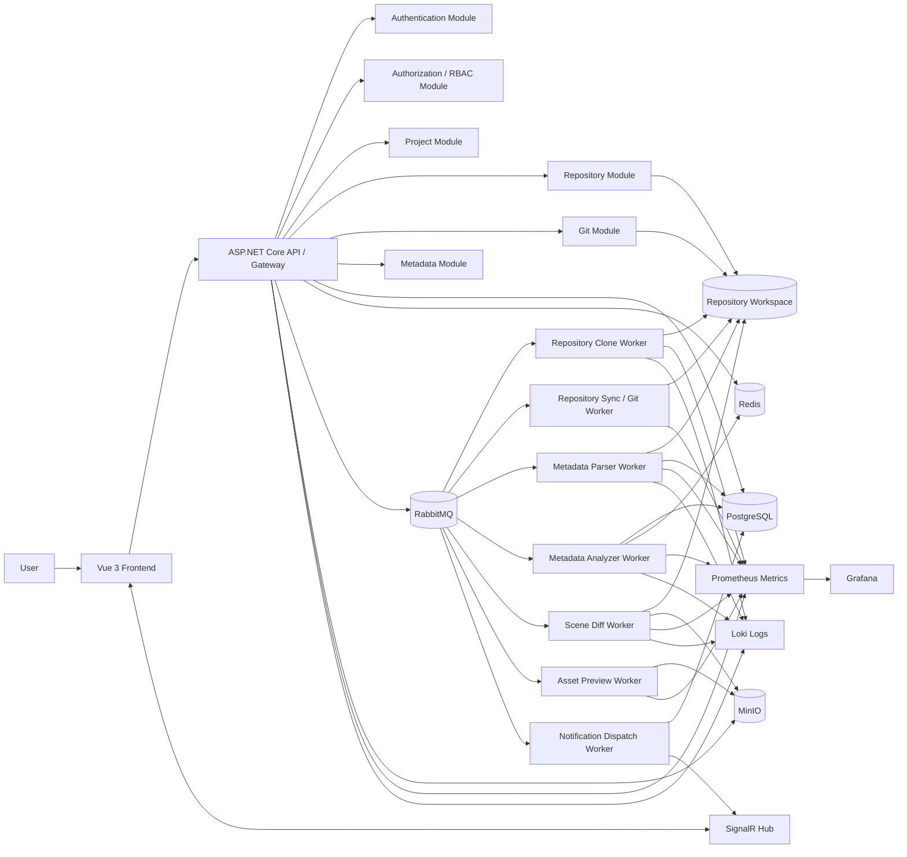

# 2. Architecture Overview

## Architecture Goals

GodForge uses a layered web architecture with asynchronous workers. The main goal is to keep HTTP requests fast while moving long-running work such as repository clone, fetch, parse, analyze, diff generation, and preview generation into background jobs.

The architecture prioritizes:

- clear module boundaries;
- server-side authorization and validation;
- reliable background processing;
- traceability through correlation IDs;
- safe Git workspace mutation;
- operational visibility through metrics, logs, and alerts;
- a practical MVP deployment that can scale later without redesigning the codebase.

## Architectural Style

GodForge is implemented as a modular backend with Clean Architecture boundaries.

| Layer | Main responsibility | Implementation guidance |
| --- | --- | --- |
| Presentation | REST API, request/response mapping, auth middleware, SignalR hubs | Controllers only orchestrate request input, mediator/application calls, and response mapping. They must not contain business rules. |
| Application | Use cases, CQRS handlers, DTOs, interfaces, RBAC checks, orchestration | Owns business flow and declares infrastructure interfaces. Produces jobs for async work. |
| Domain | Entities, value objects, domain rules, domain events | No infrastructure dependency. No EF Core, Redis, RabbitMQ, MinIO, Git library, or ASP.NET reference. |
| Infrastructure | EF Core, PostgreSQL, Redis, RabbitMQ, MinIO, Git implementation, external services | Implements interfaces declared by Application. |
| Worker Host | Background consumers and job handlers | Consumes RabbitMQ messages and calls application/infrastructure services while preserving correlation, idempotency, retry, and job lifecycle. |

## Main Components

| Component | Role |
| --- | --- |
| Vue 3 Frontend | Web client for dashboard, projects, Git UI, Scene Explorer, Asset Explorer, Dependency Graph, Scene Diff Viewer, notifications, and admin screens. |
| ASP.NET Core API Backend | REST `/api/v1`, authentication, RBAC, validation, orchestration, response/error format, job creation, and SignalR hubs. |
| Authentication Module | Login, JWT access token, refresh token rotation, password hashing, account state, and RBAC claim construction. |
| Project Module | Project CRUD, project membership, settings, dashboard orchestration, project-level permission checks, and activity log integration. |
| Repository Module | Repository registration, credential references, workspace state, repository lock orchestration, and clone/fetch job creation. |
| Git Module | Status, stage, unstage, commit, push, pull, branch, merge, commit history, conflict detection, and normalized Git errors. |
| Metadata Module | Versioned scene, node, asset, script, resource, dependency, statistics, and health metadata. |
| Parser Worker | Parses `.tscn`, `.tres`, `.gd`, and asset metadata from a repository snapshot. |
| Analyze Worker | Builds dependency graph, health reports, health issues, and dashboard aggregates. |
| Diff Worker | Generates scene-aware diffs between commits, branches, revisions, or workspace snapshots. |
| Preview Worker | Generates thumbnails, preview artifacts, or lightweight metadata snapshots when required. |
| Notification/Activity Module | Stores notifications, activity log records, and realtime events for user/project timelines. |
| PostgreSQL | Durable source of truth for core data, metadata, jobs, activity, and notifications. |
| Redis | Cache, rate limiting, short-lived state, and distributed locks. Redis is never the primary data store. |
| RabbitMQ | Async job queues, retry queues, and dead-letter queues. |
| MinIO | Object storage for diff artifacts, thumbnails, reports, archives, and other large generated objects. |
| Observability Stack | Prometheus metrics, Grafana dashboards, Loki logs, and alerting. |

## MVP Deployment Model

Workers are logical components. In the MVP, they may run in a shared `GodForge.Worker` host to reduce deployment complexity. Even when hosted together, each logical worker must keep its own queue, consumer class, handler/service abstraction, retry policy, metrics, and job lifecycle handling.

The code must be structured so that high-load workers can later be split into separate processes or containers without moving business rules out of Application/Domain or duplicating worker logic.

Recommended logical workers:

| Logical worker | Queue responsibility | Scale trigger |
| --- | --- | --- |
| Repository Clone Worker | Clone/fetch remote repository into managed workspace | Repository I/O or clone queue depth increases |
| Repository Sync/Git Worker | Mutating Git operations that require repository lock | Git lock wait time or Git command duration increases |
| Metadata Parser Worker | Parse Godot project files into raw metadata | Parse queue backlog or large project size |
| Metadata Analyzer Worker | Build dependency graph, statistics, and health report | Analyze duration or metadata query pressure increases |
| Scene Diff Worker | Generate scene-aware diff and diff artifacts | Diff p95 latency or artifact generation time increases |
| Asset Preview Worker | Generate thumbnails/previews | Preview queue depth increases |
| Notification Dispatch Worker | Dispatch in-app or optional email notifications | Notification backlog increases |

## Logical Architecture

## Request Processing Flow

1. The frontend calls REST API endpoints or subscribes to SignalR groups scoped by project.
2. The API validates JWT, attaches or creates a `correlationId`, applies rate limiting, and resolves the actor context.
3. The Application layer performs RBAC and project-scope permission checks before reading or mutating data.
4. For fast operations, the API reads/writes PostgreSQL or Redis and returns a synchronous response.
5. For long-running operations, the API creates a `jobs` record in PostgreSQL, publishes a RabbitMQ message, and returns `202 Accepted` with `jobId` and `correlationId`.
6. The worker consumes the message, validates message schema, checks idempotency, loads the job record, and marks the job as `running`.
7. If the job touches a repository workspace or mutates Git state, the worker acquires a Redis repository lock using an owner token.
8. The worker performs the task, updates progress, writes durable outputs to PostgreSQL and/or MinIO, and emits metrics/logs with the same `correlationId`.
9. Only after durable output is committed should the worker publish completion events, invalidate cache, send notifications, and push SignalR updates.
10. The frontend receives progress through SignalR or polls the job endpoint.

## Async Job Boundary

The API must not hold HTTP requests open for long-running work.

| Operation type | API behavior | Worker behavior |
| --- | --- | --- |
| Fast read/query | Return `200 OK` with DTO | Not required |
| Fast write | Return success or validation/conflict error after transaction | Not required unless follow-up processing is needed |
| Clone/fetch | Create job, publish message, return `202 Accepted` | Execute clone/fetch with repository lock and retry policy |
| Parse/analyze | Create job, publish message, return `202 Accepted` | Parse metadata, analyze health/dependency, update job progress |
| Scene diff/preview | Create job, publish message, return `202 Accepted` | Generate artifact, store in MinIO, update metadata/job state |
| Git mutation | Prefer job for risky or long-running mutation; local quick status may be synchronous | Acquire lock, execute Git engine, normalize errors, release lock |

PostgreSQL is the source of truth for job state. Redis may cache or assist with short-lived progress, but a worker restart must be able to recover from PostgreSQL job records.

## Job Lifecycle and Reliability

Every background job must follow the canonical lifecycle:

`queued -> running -> completed`

Alternative transitions:

- `queued -> cancelled`
- `running -> retrying -> queued`
- `running -> failed`
- `running -> timeout`
- `retrying -> dead_lettered`
- `running -> cancelled`

Worker requirements:

- include `jobId`, `messageId`, `projectId`, `repositoryId` when applicable, `actorId` when available, `correlationId`, `schemaVersion`, `attemptCount`, and `inputHash` in job messages;
- use `jobId + inputHash` for idempotency;
- avoid duplicate metadata, duplicate notifications, and stale output overwrites;
- write heartbeat/progress for long-running jobs;
- classify errors as validation, permission, transient dependency, timeout, poison message, or permanent failure;
- retry transient failures with bounded exponential backoff;
- send poison messages and exhausted retries to DLQ;
- preserve failure details for operators without exposing secrets, full stack traces, or full Git stdout/stderr to clients.

## Repository and Git Safety

Repository operations run against server-side workspaces managed by the backend and workers. Users never receive internal paths.

Rules:

- every repository belongs to a project;
- repository credentials are stored as encrypted secrets or credential references, never as plaintext;
- mutating Git operations must acquire a Redis lock with an owner token;
- lock release must verify the same owner token to avoid releasing another worker's lock;
- commit, push, pull, merge, checkout, branch deletion, clone, fetch, and analysis of a mutable working tree must not conflict on the same repository;
- merge conflicts must not be auto-resolved;
- Git errors must be normalized into stable error codes and safe messages;
- stdout/stderr may be stored only in truncated, sanitized form for debugging.

## Data Architecture

| Data category | Storage | Rule |
| --- | --- | --- |
| Users, roles, projects, memberships, repositories, jobs, activity, notifications | PostgreSQL core schema | Durable business source of truth. Must be backed up and migrated carefully. |
| Scenes, nodes, assets, scripts, resources, dependencies, statistics, health reports | PostgreSQL metadata schema | Derived from repository snapshots and metadata versions; can be regenerated but should be versioned and retained according to policy. |
| Dashboard and permission cache | Redis | Short TTL and event-based invalidation. Never source of truth. |
| Repository locks | Redis | Must use TTL and owner token. |
| Diff artifacts, thumbnails, reports, archives | MinIO | Store large or generated artifacts outside PostgreSQL. Metadata must include project/job/content type/checksum/retention. |
| Queue messages | RabbitMQ | Transport only. Durable job state remains in PostgreSQL. |

## Module Boundaries

| Module | Main inputs | Main outputs | Boundary rules |
| --- | --- | --- | --- |
| Auth | Credentials, refresh token, user/admin actions | JWT, refresh token, account state, audit activity | Never leak whether a user exists during login failure. |
| Authorization/RBAC | Actor, project id, role, permission | Allow/deny decision | Must run server-side for both commands and queries. |
| Project | Project/member/settings commands | Project aggregate, membership, settings, cache invalidation, activity | Does not perform Git operations directly; coordinates Repository/Git modules. |
| Repository | Remote URL, credential reference, default branch | Repository record, workspace state, clone/fetch job | Credential values must not be returned to clients. |
| Git | Repository id, branch, file selection, actor, Git command | Git result, conflict report, commit hash, activity | Mutating operations require lock and normalized error handling. |
| Metadata | Parser/analyzer output, project id, commit hash, job id | Metadata views, graph dataset, search documents, health report | Metadata must be scoped by project and version/commit. |
| Dashboard | Project id, actor, branch/range | Dashboard DTO, charts, health summary, activity summary | Do not do heavy computation directly in request path. |
| Search | Query, filters, project scope, actor | Paginated search result DTOs | Must enforce RBAC and distinguish “not analyzed yet” from “no results.” |
| Worker | Job message, repository snapshot/reference, correlation id | Job result, metadata, artifact, event, notification | Must be idempotent, observable, cancellable where feasible, and retry-safe. |
| Notification/Activity | Domain/worker event, actor context | Notification record, activity timeline, realtime event | Do not publish user-facing completion before durable output commits. |

## Security and Trust Boundaries

| Boundary | Required control |
| --- | --- |
| Public client to API | HTTPS, JWT validation, CORS allowlist, secure headers, rate limiting, input validation. |
| API to data services | Least-privilege connection strings, no public DB/Redis/RabbitMQ/MinIO exposure. |
| Worker to infrastructure | Private network, least-privilege service identity, resource limits, no public endpoint exposure. |
| Git credentials | AES-256-GCM or secret manager integration, no plaintext persistence, no logs, no API echo. |
| Project data access | Project-scoped RBAC for every command and query. Do not rely on frontend visibility rules. |
| Logs and errors | No password, token, credential, stack trace, or full Git output in production responses. |

## Observability and Operations

All API services and workers must emit structured logs and metrics.

Required log fields:

- `timestamp`
- `level`
- `service`
- `environment`
- `correlationId`
- `userId` when available
- `projectId` when available
- `jobId` when available
- `action`
- `status`
- `errorCode` when applicable

Required metric groups:

| Area | Example metrics |
| --- | --- |
| API | request count, request latency, error rate, auth failure count, rate limited count |
| Git | git command duration, git command failure count, repository lock wait time |
| Queue | queue depth, message age, retry count, dead-letter count |
| Worker | job duration, job success count, job failure count, heartbeat missing count, timeout count |
| Database | connection pool usage, slow query count, migration status |
| Redis | cache hit ratio, lock acquisition latency, lock contention count |
| Storage | object upload/download latency, object operation failures, bucket usage |

Minimum alerts:

- API 5xx rate exceeds threshold;
- queue depth or message age grows continuously;
- worker heartbeat missing or timeout rate increases;
- Git command failure spikes;
- database connection pool is near exhaustion;
- Redis, RabbitMQ, PostgreSQL, or MinIO is unavailable;
- backup fails or restore test fails.

## Deployment Architecture

Recommended MVP deployment uses Docker Compose or an equivalent container environment.

| Container/node | Runs | Public access | Notes |
| --- | --- | --- | --- |
| `web-client` | Vue 3 static build or development server | Yes, through reverse proxy/HTTPS | Contains no secrets. Public config only includes API base URL. |
| `api-backend` | ASP.NET Core API | Yes, `/api/v1` and SignalR | Stateless when possible. Can scale horizontally. |
| `worker` | Shared MVP worker host with logical consumers | No | Can later split into `worker-git`, `worker-analysis`, `worker-diff`, etc. |
| `postgres` | Core and metadata schemas | No | Requires backup, migration control, and connection pooling. |
| `redis` | Cache, rate limit, lock | No | TTL required for cache and locks. |
| `rabbitmq` | Queue, retry, DLQ | No | Requires queue depth and DLQ metrics. |
| `minio` | Object storage | No, except controlled admin access if needed | Stores artifacts, not primary relational data. |
| `observability` | Prometheus, Grafana, Loki | Admin-only | Logs must be sanitized before ingestion. |

Production or advanced demo environments may split workers by workload and scale API/worker instances independently. Database, broker, cache, and storage must remain private network services.

## Scalability Strategy

| Bottleneck | Strategy | Risk to control |
| --- | --- | --- |
| API read traffic | Scale stateless API instances and cache dashboard/permission summaries in Redis | Stale cache if invalidation is weak |
| Worker backlog | Scale consumers by queue type | Duplicate work unless idempotency is enforced |
| Git I/O | Separate Git worker and limit concurrency per repository | Do not scale mutating Git operations blindly on the same repository |
| Metadata queries | Index, paginate, use summary/materialized tables where useful | Too many indexes can slow metadata writes |
| Artifacts | Store large outputs in MinIO with lifecycle cleanup | Orphaned objects if cleanup is not coordinated |
| Search | PostgreSQL search/index tables with bounded query length and pagination | Unbounded query can overload DB |

Backpressure is required. When queue pressure is high, API should limit pending jobs per project/user rather than accepting unlimited job creation.

## Architecture Non-Negotiables

- Do not put business logic in controllers, worker host bootstrap code, or infrastructure adapters.
- Do not let Domain or Application depend on Infrastructure.
- Do not bypass RBAC for API reads or worker-triggered operations.
- Do not use Redis as the durable source of truth for jobs or business data.
- Do not run long clone/parse/analyze/diff/preview work inside a normal HTTP request.
- Do not publish completion notifications before PostgreSQL/MinIO outputs are committed.
- Do not log credentials, tokens, passwords, stack traces, or full Git stdout/stderr in production responses.
- Do not auto-resolve Git conflicts.
- Do not create circular project references or hidden module coupling.