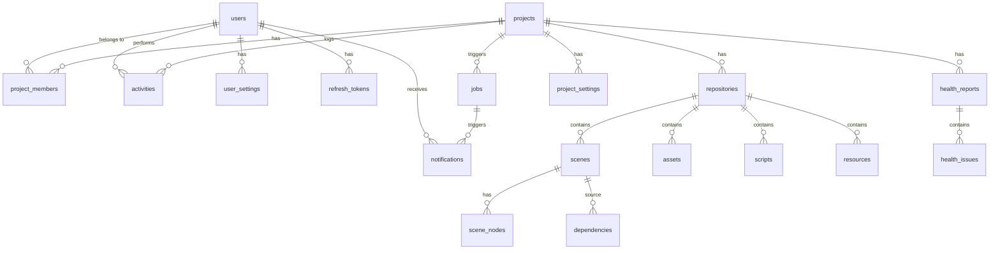

# 4. Kiến trúc Dữ liệu (Database)

## 4.1 Cơ sở dữ liệu chính: PostgreSQL

### ERD — Entity Relationship Diagram

---

### Core Schema (Dữ liệu cốt lõi)
Lưu trữ thông tin nghiệp vụ quan trọng, yêu cầu backup thường xuyên.

---

#### `users`
Tài khoản người dùng trong hệ thống.

| Column | Type | Nullable | Default | Constraints | Mô tả |
|--------|------|----------|---------|-------------|-------|
| `id` | `uuid` | NO | `gen_random_uuid()` | PK | |
| `email` | `varchar(255)` | NO | | UNIQUE | Email đăng nhập |
| `display_name` | `varchar(100)` | NO | | | Tên hiển thị |
| `password_hash` | `varchar(255)` | NO | | | bcrypt hash |
| `system_role` | `varchar(20)` | NO | `'user'` | CHECK (`system_admin`, `user`) | Vai trò hệ thống |
| `status` | `varchar(20)` | NO | `'pending_activation'` | CHECK (`active`, `locked`, `disabled`, `pending_activation`) | Trạng thái |
| `failed_login_count` | `int` | NO | `0` | | Số lần login sai liên tiếp |
| `locked_until` | `timestamptz` | YES | | | Thời điểm hết khóa |
| `avatar_url` | `varchar(500)` | YES | | | URL ảnh đại diện |
| `created_at` | `timestamptz` | NO | `now()` | | |
| `updated_at` | `timestamptz` | NO | `now()` | | |

**Indexes:**
- `idx_users_email` UNIQUE ON (`email`)
- `idx_users_status` ON (`status`)

---

#### `refresh_tokens`
Lưu refresh token cho authentication sessions.

| Column | Type | Nullable | Default | Constraints | Mô tả |
|--------|------|----------|---------|-------------|-------|
| `id` | `uuid` | NO | `gen_random_uuid()` | PK | |
| `user_id` | `uuid` | NO | | FK → `users.id` ON DELETE CASCADE | |
| `token_hash` | `varchar(255)` | NO | | UNIQUE | SHA-256 hash of token |
| `expires_at` | `timestamptz` | NO | | | Hết hạn |
| `revoked_at` | `timestamptz` | YES | | | Thời điểm thu hồi |
| `created_at` | `timestamptz` | NO | `now()` | | |
| `user_agent` | `varchar(500)` | YES | | | Browser/device info |
| `ip_address` | `varchar(45)` | YES | | | IP đăng nhập |

**Indexes:**
- `idx_refresh_tokens_user_id` ON (`user_id`)
- `idx_refresh_tokens_token_hash` UNIQUE ON (`token_hash`)
- `idx_refresh_tokens_expires_at` ON (`expires_at`) — cho cleanup job

---

#### `projects`
Dự án Godot trong hệ thống.

| Column | Type | Nullable | Default | Constraints | Mô tả |
|--------|------|----------|---------|-------------|-------|
| `id` | `uuid` | NO | `gen_random_uuid()` | PK | |
| `name` | `varchar(50)` | NO | | UNIQUE | Tên project (unique, case-insensitive) |
| `slug` | `varchar(50)` | NO | | UNIQUE | URL-safe slug |
| `description` | `text` | YES | | | Mô tả |
| `godot_version` | `varchar(20)` | NO | `'4.x'` | | Phiên bản Godot |
| `visibility` | `varchar(20)` | NO | `'private'` | CHECK (`private`, `internal`) | |
| `health_score` | `int` | YES | | CHECK (0-100) | Cache health score mới nhất |
| `created_by` | `uuid` | NO | | FK → `users.id` | Người tạo |
| `created_at` | `timestamptz` | NO | `now()` | | |
| `updated_at` | `timestamptz` | NO | `now()` | | |
| `deleted_at` | `timestamptz` | YES | | | Soft-delete timestamp |

**Indexes:**
- `idx_projects_name` UNIQUE ON (`lower(name)`) — case-insensitive unique
- `idx_projects_slug` UNIQUE ON (`slug`)
- `idx_projects_deleted_at` ON (`deleted_at`) — cho filter active projects
- `idx_projects_created_by` ON (`created_by`)

---

#### `project_members`
Liên kết user và project kèm project-level role.

| Column | Type | Nullable | Default | Constraints | Mô tả |
|--------|------|----------|---------|-------------|-------|
| `id` | `uuid` | NO | `gen_random_uuid()` | PK | |
| `project_id` | `uuid` | NO | | FK → `projects.id` ON DELETE CASCADE | |
| `user_id` | `uuid` | NO | | FK → `users.id` ON DELETE CASCADE | |
| `role` | `varchar(20)` | NO | | CHECK (`project_owner`, `project_admin`, `developer`, `reviewer`, `viewer`) | |
| `invited_by` | `uuid` | YES | | FK → `users.id` | Ai mời |
| `joined_at` | `timestamptz` | NO | `now()` | | |

**Indexes:**
- `idx_pm_project_user` UNIQUE ON (`project_id`, `user_id`)
- `idx_pm_user_id` ON (`user_id`) — cho query "projects of user"

---

#### `repositories`
Cấu hình Git repository của project.

| Column | Type | Nullable | Default | Constraints | Mô tả |
|--------|------|----------|---------|-------------|-------|
| `id` | `uuid` | NO | `gen_random_uuid()` | PK | |
| `project_id` | `uuid` | NO | | FK → `projects.id` ON DELETE CASCADE, UNIQUE | Mỗi project 1 repo |
| `remote_url` | `varchar(500)` | NO | | | Git remote URL (HTTPS) |
| `credential_ref` | `text` | NO | | | Encrypted PAT (AES-256-GCM) |
| `default_branch` | `varchar(100)` | NO | `'main'` | | Branch mặc định |
| `workspace_path` | `varchar(500)` | YES | | | Server-side clone path |
| `clone_status` | `varchar(20)` | NO | `'pending'` | CHECK (`pending`, `cloning`, `ready`, `error`) | |
| `last_synced_at` | `timestamptz` | YES | | | Lần sync cuối |
| `repo_size_bytes` | `bigint` | YES | | | Kích thước repo |
| `created_at` | `timestamptz` | NO | `now()` | | |
| `updated_at` | `timestamptz` | NO | `now()` | | |

**Indexes:**
- `idx_repositories_project_id` UNIQUE ON (`project_id`)

---

#### `jobs`
Trạng thái tác vụ bất đồng bộ.

| Column | Type | Nullable | Default | Constraints | Mô tả |
|--------|------|----------|---------|-------------|-------|
| `id` | `uuid` | NO | `gen_random_uuid()` | PK | |
| `project_id` | `uuid` | NO | | FK → `projects.id` ON DELETE CASCADE | |
| `type` | `varchar(30)` | NO | | CHECK (`clone`, `fetch`, `parse`, `analyze`, `diff`) | Loại job |
| `status` | `varchar(20)` | NO | `'queued'` | CHECK (`queued`, `running`, `completed`, `failed`, `cancelled`) | |
| `progress` | `int` | NO | `0` | CHECK (0-100) | % hoàn thành |
| `started_at` | `timestamptz` | YES | | | Bắt đầu xử lý |
| `completed_at` | `timestamptz` | YES | | | Hoàn thành |
| `error_message` | `text` | YES | | | Chi tiết lỗi |
| `error_code` | `varchar(50)` | YES | | | Mã lỗi |
| `metadata` | `jsonb` | YES | | | Thông tin bổ sung (branch, commit, etc.) |
| `triggered_by` | `uuid` | YES | | FK → `users.id` | User kích hoạt (null = system) |
| `correlation_id` | `varchar(50)` | NO | | | Trace ID |
| `created_at` | `timestamptz` | NO | `now()` | | |

**Indexes:**
- `idx_jobs_project_id` ON (`project_id`)
- `idx_jobs_status` ON (`status`) — cho worker pick up
- `idx_jobs_type_status` ON (`type`, `status`)
- `idx_jobs_created_at` ON (`created_at` DESC)

---

#### `activities`
Audit log cho các thao tác quan trọng.

| Column | Type | Nullable | Default | Constraints | Mô tả |
|--------|------|----------|---------|-------------|-------|
| `id` | `uuid` | NO | `gen_random_uuid()` | PK | |
| `project_id` | `uuid` | YES | | FK → `projects.id` ON DELETE SET NULL | null = system-level action |
| `user_id` | `uuid` | YES | | FK → `users.id` ON DELETE SET NULL | null = system action |
| `action` | `varchar(50)` | NO | | | Action type (xem FR-18) |
| `target_type` | `varchar(30)` | YES | | | Loại đối tượng (project, user, repo...) |
| `target_id` | `uuid` | YES | | | ID đối tượng |
| `metadata` | `jsonb` | YES | | | Chi tiết bổ sung |
| `ip_address` | `varchar(45)` | YES | | | IP nguồn |
| `correlation_id` | `varchar(50)` | NO | | | Trace ID |
| `created_at` | `timestamptz` | NO | `now()` | | |

**Indexes:**
- `idx_activities_project_id` ON (`project_id`)
- `idx_activities_user_id` ON (`user_id`)
- `idx_activities_action` ON (`action`)
- `idx_activities_created_at` ON (`created_at` DESC)

---

#### `notifications`
Thông báo cho người dùng.

| Column | Type | Nullable | Default | Constraints | Mô tả |
|--------|------|----------|---------|-------------|-------|
| `id` | `uuid` | NO | `gen_random_uuid()` | PK | |
| `user_id` | `uuid` | NO | | FK → `users.id` ON DELETE CASCADE | Người nhận |
| `project_id` | `uuid` | YES | | FK → `projects.id` ON DELETE CASCADE | |
| `type` | `varchar(30)` | NO | | | Loại notification (xem FR-16) |
| `title` | `varchar(200)` | NO | | | Tiêu đề |
| `message` | `text` | NO | | | Nội dung |
| `is_read` | `boolean` | NO | `false` | | Đã đọc |
| `job_id` | `uuid` | YES | | FK → `jobs.id` ON DELETE SET NULL | Job liên quan |
| `created_at` | `timestamptz` | NO | `now()` | | |

**Indexes:**
- `idx_notifications_user_id_read` ON (`user_id`, `is_read`) — cho unread count
- `idx_notifications_created_at` ON (`created_at` DESC)

---

#### `project_settings`
Cấu hình dự án.

| Column | Type | Nullable | Default | Constraints | Mô tả |
|--------|------|----------|---------|-------------|-------|
| `id` | `uuid` | NO | `gen_random_uuid()` | PK | |
| `project_id` | `uuid` | NO | | FK → `projects.id` ON DELETE CASCADE, UNIQUE | |
| `auto_parse_on_push` | `boolean` | NO | `true` | | Tự động parse khi push |
| `auto_analyze_on_parse` | `boolean` | NO | `true` | | Tự động analyze sau parse |
| `health_check_schedule` | `varchar(20)` | NO | `'daily'` | CHECK (`manual`, `daily`, `weekly`) | |
| `notification_email_enabled` | `boolean` | NO | `true` | | Gửi email notification |
| `created_at` | `timestamptz` | NO | `now()` | | |
| `updated_at` | `timestamptz` | NO | `now()` | | |

---

#### `user_settings`
Tùy chọn cá nhân của user.

| Column | Type | Nullable | Default | Constraints | Mô tả |
|--------|------|----------|---------|-------------|-------|
| `id` | `uuid` | NO | `gen_random_uuid()` | PK | |
| `user_id` | `uuid` | NO | | FK → `users.id` ON DELETE CASCADE, UNIQUE | |
| `theme` | `varchar(10)` | NO | `'dark'` | CHECK (`dark`, `light`) | |
| `notification_in_app` | `boolean` | NO | `true` | | |
| `notification_email` | `boolean` | NO | `true` | | |
| `created_at` | `timestamptz` | NO | `now()` | | |
| `updated_at` | `timestamptz` | NO | `now()` | | |

---

### Metadata Schema (Dữ liệu phân tích)
Dữ liệu sinh ra từ Worker, có thể tái tạo lại từ Repository.

---

#### `scenes`
Metadata của file `.tscn`.

| Column | Type | Nullable | Default | Constraints | Mô tả |
|--------|------|----------|---------|-------------|-------|
| `id` | `uuid` | NO | `gen_random_uuid()` | PK | |
| `repository_id` | `uuid` | NO | | FK → `repositories.id` ON DELETE CASCADE | |
| `file_path` | `varchar(500)` | NO | | | Đường dẫn trong project |
| `scene_name` | `varchar(200)` | NO | | | Tên scene (filename) |
| `format_version` | `int` | YES | | | Godot format version |
| `node_count` | `int` | NO | `0` | | Tổng số node |
| `file_hash` | `varchar(64)` | NO | | | SHA-256 hash cho incremental parse |
| `parsed_at` | `timestamptz` | NO | `now()` | | Thời điểm parse |
| `created_at` | `timestamptz` | NO | `now()` | | |
| `updated_at` | `timestamptz` | NO | `now()` | | |

**Indexes:**
- `idx_scenes_repo_id` ON (`repository_id`)
- `idx_scenes_repo_path` UNIQUE ON (`repository_id`, `file_path`)
- `idx_scenes_name` ON (`scene_name`) — cho search

---

#### `scene_nodes`
Node tree của scene.

| Column | Type | Nullable | Default | Constraints | Mô tả |
|--------|------|----------|---------|-------------|-------|
| `id` | `uuid` | NO | `gen_random_uuid()` | PK | |
| `scene_id` | `uuid` | NO | | FK → `scenes.id` ON DELETE CASCADE | |
| `node_name` | `varchar(200)` | NO | | | Tên node |
| `node_type` | `varchar(100)` | NO | | | Loại node (Node2D, Sprite2D...) |
| `parent_path` | `varchar(500)` | NO | `'.'` | | Parent path (`.` = root) |
| `node_index` | `int` | NO | `0` | | Thứ tự trong parent |
| `script_path` | `varchar(500)` | YES | | | Script file gắn kèm |
| `groups` | `text[]` | YES | | | Danh sách groups |
| `properties` | `jsonb` | YES | | | Key-value properties |

**Indexes:**
- `idx_scene_nodes_scene_id` ON (`scene_id`)
- `idx_scene_nodes_type` ON (`node_type`) — cho filter
- `idx_scene_nodes_name` ON (`node_name`) — cho search

---

#### `assets`
Thông tin file asset.

| Column | Type | Nullable | Default | Constraints | Mô tả |
|--------|------|----------|---------|-------------|-------|
| `id` | `uuid` | NO | `gen_random_uuid()` | PK | |
| `repository_id` | `uuid` | NO | | FK → `repositories.id` ON DELETE CASCADE | |
| `file_path` | `varchar(500)` | NO | | | Đường dẫn trong project |
| `file_name` | `varchar(200)` | NO | | | Tên file |
| `asset_type` | `varchar(30)` | NO | | | image, audio, font, shader, other |
| `file_size_bytes` | `bigint` | NO | `0` | | Kích thước |
| `mime_type` | `varchar(100)` | YES | | | MIME type |
| `dimensions` | `jsonb` | YES | | | `{"width": 1920, "height": 1080}` cho image |
| `thumbnail_path` | `varchar(500)` | YES | | | MinIO path cho thumbnail |
| `file_hash` | `varchar(64)` | NO | | | SHA-256 hash |
| `created_at` | `timestamptz` | NO | `now()` | | |
| `updated_at` | `timestamptz` | NO | `now()` | | |

**Indexes:**
- `idx_assets_repo_id` ON (`repository_id`)
- `idx_assets_repo_path` UNIQUE ON (`repository_id`, `file_path`)
- `idx_assets_type` ON (`asset_type`)

---

#### `resources`
Thông tin file `.tres`, `.res`.

| Column | Type | Nullable | Default | Constraints | Mô tả |
|--------|------|----------|---------|-------------|-------|
| `id` | `uuid` | NO | `gen_random_uuid()` | PK | |
| `repository_id` | `uuid` | NO | | FK → `repositories.id` ON DELETE CASCADE | |
| `file_path` | `varchar(500)` | NO | | | Đường dẫn |
| `resource_type` | `varchar(100)` | NO | | | Godot resource type |
| `file_hash` | `varchar(64)` | NO | | | SHA-256 |
| `properties` | `jsonb` | YES | | | Properties chính |
| `created_at` | `timestamptz` | NO | `now()` | | |
| `updated_at` | `timestamptz` | NO | `now()` | | |

**Indexes:**
- `idx_resources_repo_id` ON (`repository_id`)
- `idx_resources_repo_path` UNIQUE ON (`repository_id`, `file_path`)

---

#### `scripts`
Thông tin file `.gd`.

| Column | Type | Nullable | Default | Constraints | Mô tả |
|--------|------|----------|---------|-------------|-------|
| `id` | `uuid` | NO | `gen_random_uuid()` | PK | |
| `repository_id` | `uuid` | NO | | FK → `repositories.id` ON DELETE CASCADE | |
| `file_path` | `varchar(500)` | NO | | | Đường dẫn |
| `class_name` | `varchar(200)` | YES | | | class_name nếu có |
| `extends_type` | `varchar(200)` | YES | | | extends Node2D, etc. |
| `line_count` | `int` | NO | `0` | | Số dòng code |
| `file_hash` | `varchar(64)` | NO | | | SHA-256 |
| `created_at` | `timestamptz` | NO | `now()` | | |
| `updated_at` | `timestamptz` | NO | `now()` | | |

**Indexes:**
- `idx_scripts_repo_id` ON (`repository_id`)
- `idx_scripts_repo_path` UNIQUE ON (`repository_id`, `file_path`)
- `idx_scripts_class_name` ON (`class_name`) — cho search

---

#### `dependencies`
Quan hệ phụ thuộc (cạnh của dependency graph).

| Column | Type | Nullable | Default | Constraints | Mô tả |
|--------|------|----------|---------|-------------|-------|
| `id` | `uuid` | NO | `gen_random_uuid()` | PK | |
| `repository_id` | `uuid` | NO | | FK → `repositories.id` ON DELETE CASCADE | |
| `source_type` | `varchar(20)` | NO | | CHECK (`scene`, `script`, `resource`) | Loại nguồn |
| `source_path` | `varchar(500)` | NO | | | File path nguồn |
| `target_type` | `varchar(20)` | NO | | CHECK (`scene`, `script`, `resource`, `asset`) | Loại đích |
| `target_path` | `varchar(500)` | NO | | | File path đích |
| `relation` | `varchar(30)` | NO | | CHECK (`instances`, `attaches`, `uses`, `references`, `extends`, `preload`, `load`) | Kiểu quan hệ |
| `created_at` | `timestamptz` | NO | `now()` | | |

**Indexes:**
- `idx_deps_repo_id` ON (`repository_id`)
- `idx_deps_source` ON (`repository_id`, `source_type`, `source_path`)
- `idx_deps_target` ON (`repository_id`, `target_type`, `target_path`) — cho reverse lookup
- `idx_deps_unique` UNIQUE ON (`repository_id`, `source_path`, `target_path`, `relation`)

---

#### `health_reports`
Báo cáo sức khỏe dự án.

| Column | Type | Nullable | Default | Constraints | Mô tả |
|--------|------|----------|---------|-------------|-------|
| `id` | `uuid` | NO | `gen_random_uuid()` | PK | |
| `project_id` | `uuid` | NO | | FK → `projects.id` ON DELETE CASCADE | |
| `score` | `int` | NO | | CHECK (0-100) | Health score |
| `total_issues` | `int` | NO | `0` | | Tổng số issues |
| `critical_count` | `int` | NO | `0` | | Số issues critical |
| `warning_count` | `int` | NO | `0` | | Số issues warning |
| `info_count` | `int` | NO | `0` | | Số issues info |
| `job_id` | `uuid` | YES | | FK → `jobs.id` | Job sinh report |
| `created_at` | `timestamptz` | NO | `now()` | | |

**Indexes:**
- `idx_health_reports_project_id` ON (`project_id`)
- `idx_health_reports_created_at` ON (`created_at` DESC) — cho history/trend

---

#### `health_issues`
Chi tiết issues trong health report.

| Column | Type | Nullable | Default | Constraints | Mô tả |
|--------|------|----------|---------|-------------|-------|
| `id` | `uuid` | NO | `gen_random_uuid()` | PK | |
| `report_id` | `uuid` | NO | | FK → `health_reports.id` ON DELETE CASCADE | |
| `issue_type` | `varchar(30)` | NO | | | Loại issue (xem FR-12) |
| `severity` | `varchar(10)` | NO | | CHECK (`critical`, `warning`, `info`) | |
| `file_path` | `varchar(500)` | YES | | | File liên quan |
| `message` | `text` | NO | | | Mô tả vấn đề |
| `details` | `jsonb` | YES | | | Chi tiết bổ sung |
| `created_at` | `timestamptz` | NO | `now()` | | |

**Indexes:**
- `idx_health_issues_report_id` ON (`report_id`)
- `idx_health_issues_severity` ON (`severity`)

---

## 4.2 Cache & Lock: Redis

### Key Patterns
| Pattern | Mô tả | TTL |
|---------|-------|-----|
| `dashboard:{project_id}` | Cache dashboard data (JSON) | 5 phút |
| `health:{project_id}` | Cache health score + top issues | 5 phút |
| `lock:repo:{repository_id}` | Distributed lock cho Git operations | 5 phút |
| `rate_limit:{user_id}:{endpoint}` | Rate limiting | 1 phút |
| `session:{user_id}` | Active session count | Theo access token TTL |

### Distributed Lock Strategy
- Sử dụng Redis `SET NX EX` pattern (hoặc Redlock nếu multi-node).
- Lock key: `lock:repo:{repository_id}`.
- TTL: 300 giây (5 phút). Auto-release nếu Worker crash.
- Retry: 3 lần, delay 2 giây giữa mỗi retry.
- Nếu lock fail → trả HTTP 423 Locked cho client.

## 4.3 Object Storage: MinIO

### Bucket Structure
| Bucket | Nội dung | Retention |
|--------|---------|-----------|
| `diff-artifacts` | Scene diff results (JSON) | 7 ngày (auto-expire) |
| `thumbnails` | Asset thumbnail images | Theo lifecycle repo |
| `reports` | Export health reports | 30 ngày |
| `archives` | Repository snapshots | Manual delete |

## 4.4 Quy tắc thiết kế Entity
- Mọi bảng bắt buộc có khóa chính `id` kiểu `uuid`.
- Cột Audit: `created_at`, `updated_at` (kiểu `timestamptz`, UTC).
- Đánh Index hợp lý cho các trường dùng để tìm kiếm, filter, join.
- Ràng buộc Foreign Key chặt chẽ ở Core Schema.
- Metadata Schema hạn chế FK phức tạp — cho phép bulk insert nhanh từ Worker.
- Soft-delete sử dụng `deleted_at` column (chỉ áp dụng cho `projects`).
- JSONB dùng cho dữ liệu linh hoạt (properties, metadata, dimensions).
